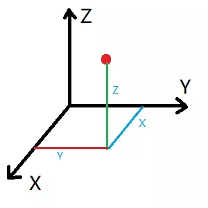
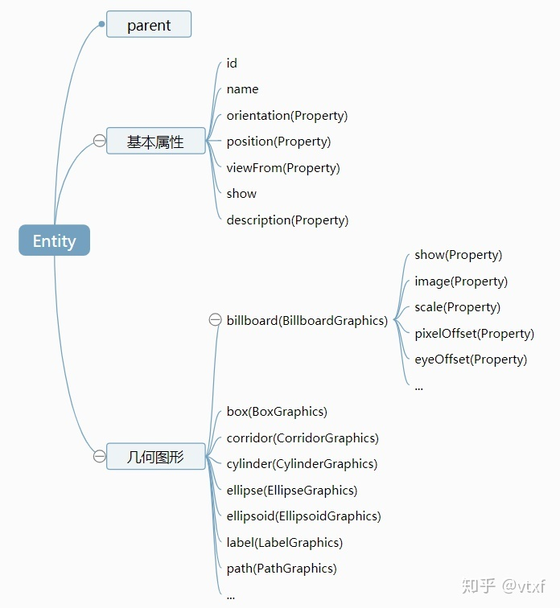
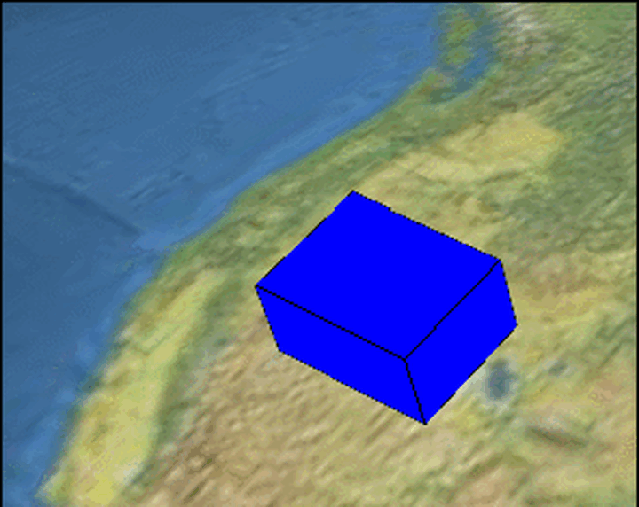

##  使用Cesium的记录

[toc]
## 〇、新建一个Cesium.viewer时的配置

[Cesium开发入门篇 | 04Viewer界面介绍及组件显隐 - 知乎 (zhihu.com)](https://zhuanlan.zhihu.com/p/332199455)


## 一、Cesium中的坐标系

 Cesium中常用的坐标有两种**WGS84地理坐标系**和笛卡尔空间坐标系，我们平时常用的以经纬度来指明一个地点就是用的WGS84坐标，笛卡尔空间坐标系常用来做一些空间位置变换如平移旋转缩放等等。二者的联系如下图:<span style="color:red">WGS84地理坐标系和Cartesian空间坐标系.png</span>

 WGS84地理坐标系包括<span style="color:red"> WGS84经纬度坐标系（没有实际的对象）</span>和<span style="color:red">
WGS84弧度坐标系（Cartographic）</span>；

 笛卡尔空间坐标系包括平面坐标系（Cartesian2），笛卡尔空间直角坐标系（Cartesian3）、4D笛卡尔坐标系（Cartesian4）。

 Cesium目前支持两种坐标系WGS84和WebMercator，但是在Cesium中没有实际的对象来描述WGS84坐标，都是以弧度（π=180°）的方式来进行，也就是Cartographic类：

 new Cesium.Cartographic(longitude, latitude, height)，这里的参数也叫longitude、latitude，就是经度和纬度，计算方法：弧度=
π/180×经纬度。经度范围[-180，180]，纬度范围[-90，90]

#### Cartesian2介绍

 new Cesium.Cartesian2(x, y)。Cartesian2经常用来描述屏幕坐标系，比如鼠标在电脑屏幕上的点击位置，返回的就是Cartesian2，返回了鼠标点击位置的xy像素点分量。

D:\codes\giteeProject\jsMarkDown\Cesium\Cesium知识点.assets\平面坐标系.jpg

#### Cartesian3介绍

笛卡尔空间坐标的原点就是椭球的中心，我们在计算机上进行绘图时，不方便使用经纬度直接进行绘图，一般会将坐标系转换为笛卡尔坐标系（xyz），使用计算机图形学中的知识进行绘图。这里的Cartesian3，有点类似于三维系统中的Point3D对象，new
Cesium.Cartesian3(x, y, z)，里面三个分量x、y、z。

 Cartesian3格式

{x: -2155350.226166898,

y: -4622163.476136757,

z: 3817393.160348164

}




#### Cartographic介绍

 new Cesium.Cartographic(longitude, latitude, height)，由经度、纬度、高度定义的空间位置。

 默认单位是弧度

#### 角度<------>弧度的转换

```js
var radians=Cesium.Math.toRadians（degrees）;   //经纬度转弧度
var degrees=Cesium.Math.toDegrees（radians）;   //弧度转经纬度
```

#### WGS84（角度)------->WGS84(弧度)（Cartographic）的转换

```js
//方法一,角度单个值转成弧度，toRadians()参数是角度。
var lng = Cesium.Math.toRadians(longitude1);
var lat= Cesium.Math.toRadians(latitude1); 		

var cartographic = new Cesium.Cartographic(longitude, latitude, height)；

//方法二，一个角度的坐标值转为弧度坐标值，longitude和latitude为角度
var cartographic= Cesium.Cartographic.fromDegrees(longitude, latitude, height);.


//方法三，lng和lat弧度制生成新的Cartorgraphic
var cartographic= Cesium.Cartographic.fromRadians(longitude, latitude, height);//其中，longitude和latitude为弧度
```

#### WGS84（角度，弧度）------->Cartesian3（xyz）

```js
//其中，高度默认值为0，可以不用填写；longitude和latitude为角度
var position = Cesium.Cartesian3.fromDegrees(longitude, latitude, height)；

//其中，coordinates格式为不带高度的数组。例如：[-115.0, 37.0, -107.0, 33.0]

//转换后的positions也是数组[Cartesian3, Cartesian3] [{x:10,y:20,z:15},{x:10,y:20,z:15}]
var positions = Cesium.Cartesian3.fromDegreesArray(coordinates);

//coordinates格式为带有高度的数组。例如：[-115.0, 37.0, 100000.0, -107.0, 33.0, 150000.0]
var positions = Cesium.Cartesian3.fromDegreesArrayHeights(coordinates);

//同理，通过弧度转换，用法相同，具体有
Cesium.Cartesian3.fromRadians，
Cesium.Cartesian3.fromRadiansArray，
Cesium.Cartesian3.fromRadiansArrayHeights等方法
//注意：上述转换函数中最后均有一个默认参数ellipsoid（默认值为Ellipsoid.WGS84）。
```

#### Cartesian3(xyz)--------WGS84(经纬度)

1. 直接转换

```js
// xyz转成角度制经纬度（117.xxx，37.xxxx）需要两步，先转成弧度的对象Cartographic，
let cartographic= Cesium.Cartographic.fromCartesian(cartesian3)

let latitude =Cesium.Math.toDegrees(cartographic.latitude)
//cartographic是一个对象，取出其中的弧度制的经纬度再转换
//cartographic.latitude
//cartographic.longitude
//使用经纬度和弧度的转换Cesium.Math.toDegrees()，进行转换到目标值
```

#### Cesium中的pick讲解

 Cesium中有多种pick的方法，例如 scene中有pick、pickPosition、及drillPick等，camera中有getPickRay、pickEllipsoid等，globel中有pick；

**scene中**（一般用来获取entity对象）：

​        <strong style="color:#DD5145">pick</strong>：``scene.pick``可以通过此方法获取到pick对象，通过``pick.id``即可拾取当前的**entity对象**
，也可以获取Cesium3DTileFeature对象；

​        <strong style="color:#DD5145">drillPick</strong>：``scene.drillPick(click.position)``
是从当前鼠标点击位置获取entity的集合，然后通过for循环可以获取当前坐标下的**所有entity**；

​        <strong style="color:#DD5145">pickPosition</strong>：通过``viewer.scene.pickPosition(evt.position)``
获取，可以获取场中任意点击处的对应的**世界坐标**。（高程不精确）

​        <strong style="color:#DD5145">pick与drillPick的区别</strong>
：pick只可获取一个entity对象（如该位置存在多个entity，哪怕面点线不在同一高度，面entity都可能会盖住点线entity），但drillPick可获取当前坐标下的**多个对象**；

**camera和globel中的pick：**

 这两个里面的pick一般搭配使用，通过camera中的getPickRay获取ray，然后通过globel中的pick方法，获取世界坐标，如下面的**地形坐标的获取**；

​        <strong style="color:#DD5145">通过pick进行地形上的坐标的获取，</strong>见下面的屏幕坐标转地表坐标

#### Cartesian2----->Cartesian3

 这里注意的是当前的点(Cartesian2)必须在三维球上，否则返回的是undefined；通过 ``ScreenSpaceEventHandler``回调会取到的坐标都是Cartesian2。

**屏幕坐标转场景坐标-获取倾斜摄影或模型点击处的坐标**

 这里的场景坐标是包含了地形、倾斜摄影表面、模型的坐标。

 通过viewer.scene.pickPosition(evt.position)获取，根据窗口坐标，从场景的深度缓冲区中拾取相应的位置，返回笛卡尔坐标。

```js
//handler要进行深入的学习。
const handler = new Cesium.ScreenSpaceEventHandler(viewer.scene.canvas);
//一个获取鼠标点击点经纬度的例子
handler.setInputAction(function (evt) {  
  var Car3 = viewer.scene.pickPosition(evt.position);  //返回值是Cartesian3  
  let cartographic= Cesium.Cartographic.fromCartesian(cartesian3)//返回值是弧度制的经纬度
  let lat =Cesium.Math.toDegrees(cartographic.latitude)		 //转为度
  let log =Cesium.Math.toDegrees(cartographic.longitude)	
}, Cesium.ScreenSpaceEventType.LEFT_CLICK);

//若屏幕坐标处没有倾斜摄影表面、模型时，获取的笛卡尔坐标不准，此时要开启地形深度检测
//（viewer.scene.globe.depthTestAgainstTerrain = true; //默认为false）。
```

**屏幕坐标转地表坐标-获取加载地形后对应的经纬度和高程**

 这里是地球表面的世界坐标，包含地形，不包括模型、倾斜摄影表面。

 通过viewer.scene.globe.pick(ray, scene)获取，其中`ray=viewer.camera.getPickRay(movement.position)`。

```js
//固定写法，构造出handler实例对象
const handler = new Cesium.ScreenSpaceEventHandler(viewer.scene.canvas);

handler.setInputAction(function (movement) {  
  var ray = viewer.camera.getPickRay(movement.position);			// 屏幕坐标转ray
  
  var position = viewer.scene.globe.pick(ray, viewer.scene);	// ray和地形交点，cartesian3
  
}, Cesium.ScreenSpaceEventType.LEFT_CLICK);

//position 是Cartesian3格式，开启地形后，转为cartographic坐标，height为该点的地形高程值。

```

**屏幕坐标转椭球面坐标-获取鼠标点的对应椭球面位置**

 这里的椭球面坐标是参考椭球的WGS84坐标(Ellipsoid.WGS84)，不包含地形、模型、倾斜摄影表面。

 通过 <span style="color:red">`viewer.scene.camera.pickEllipsoid(evt.position, ellipsoid)`</span>
获取，可以获取当前点击视线与椭球面相交处的坐标，其中ellipsoid是当前地球使用的椭球对象：viewer.scene.globe.ellipsoid，默认为Ellipsoid.WGS84。

```js
const handler = new Cesium.ScreenSpaceEventHandler(viewer.scene.canvas);
handler.setInputAction(function (evt) {
     var position = viewer.scene.camera.pickEllipsoid(
         evt.position,
         viewer.scene.globe.ellipsoid
     );
     console.log(position);
}, Cesium.ScreenSpaceEventType.LEFT_CLICK);
```

#### Cartesian3 ----->Cartesian2

```js
// WGS84 to WindowCoordinates
var cartesian2= Cesium.SceneTransforms.wgs84ToWindowCoordinates(viewer.scene,cartesian3)
```

#### 空间位置变换

 经纬度转换到笛卡尔坐标系（xyz）后就能运用计算机图形学中的仿射变换知识进行空间位置变换如平移旋转缩放。Cesium为我们提供了很有用的变换工具类：

    Cesium.Cartesian3（相当于Point3D）
    
    Cesium.Matrix3（3x3矩阵，用于描述旋转变换）
    
    Cesium.Matrix4（4x4矩阵，用于描述旋转加平移变换）
    
    Cesium.Quaternion（四元数，用于描述围绕某个向量旋转一定角度的变换）。

下面举个例子：

一个局部坐标为p1(x,y,z)的点，将它的局部坐标原点放置到 loc (lng,lat,alt)上，局部坐标的z轴垂直于地表，局部坐标的y轴指向正北，并围绕这个z轴旋转d度，求此时p1(x,y,z)变换成全局坐标笛卡尔坐p2(
x1,y1,z1)是多少？

```js

var rotate = Cesium.Math.toRadians(d);						//转成弧度
var quat = Cesium.Quaternion.fromAxisAngle(Cesium.Cartesian3.UNIT_Z, rotate); //quat为围绕这个z轴旋转d度的四元数

var rot_mat3 = Cesium.Matrix3.fromQuaternion(quat);//rot_mat3为根据四元数求得的旋转矩阵
var v = new Cesium.Cartesian3(x, y, z);//p1的局部坐标
var m = Cesium.Matrix4.fromRotationTranslation(rot_mat3, Cesium.Cartesian3.ZERO);//m为旋转加平移的4x4变换矩阵，这里平移为(0,0,0)，故填个Cesium.Cartesian3.ZERO
m = Cesium.Matrix4.multiplyByTranslation(m, v);//m = m X v

var cart3 = ellipsoid.cartographicToCartesian(Cesium.Cartographic.fromDegrees(lng, lat, alt)); //得到局部坐标原点的全局坐标

var m1 = Cesium.Transforms.eastNorthUpToFixedFrame(cart3);//m1为局部坐标的z轴垂直于地表，局部坐标的y轴指向正北的4x4变换矩阵
m = Cesium.Matrix4.multiplyTransformation(m, m1);//m = m X m1
var p2 = Cesium.Matrix4.getTranslation(m);//根据最终变换矩阵m得到p2
console.log('x=' + p2.x + ',y=' + p2.y + ',z=' + p2.z );

//艹，看晕乎了
```

## 二、Cesium之CallbackProperty

 对于时间上的数据，CallbackProperty是最大功臣。因为使用CallbackProperty，cesium中一切可视化的要素都可以与时间联系起来。

#### CallBackProperty是什么，有什么用

 Cesium中的entities可以随时间变化长度高度，主要依赖于CallbackProperty函数。

 定义：new Cesium.CallbackProperty (callback, isConstant)

 callback：评估属性时要调用的函数。isConstant：每次回调函数返回相同值时，为 true，如果值将更改，则为false。

 从函数定义可以看出，因为使用CallbackProperty，cesium中一切可视化的要素都可以与时间联系起来。

 CallbackProperty是一个类，其值由回调函数延迟计算。也就是说它在<span style="color:red">不断地自我调用</span>，每当其返回的对象有改变，就抛出改变后的值。（对数据监测？）。

 利用这种特性，我们就可以在定义材质时，用CallbackProperty生成动态的对象赋值给材质参数，就可以得到动态材质的效果。

 说白了，<span style="color:red">`new Cesium.CallbackProperty(callback, isConstant)`</span>
就是一个返回的值，而这个值取决于callback函数返回的值。该函数通常这样定义：<span style="color:red">`function callback(time, result)`</span>，返回的值是 时间+位置或长度。

## 三、Cesium之Entity




 Entity表示一个实体对象，准确的讲，应该是一个可以<span style="color : red">`随时间动态变化的实体对象`</span>
。为什么这样说呢？Cesium为了让Entity能够赋予时间的动态特性，把其属性都仔细设计了一番，特别引入了<span style="color : red">`Property`</span>这个类
。比如position本来用经纬度表示一下就ok了，结果现在它被设计成Property
类型。好处是这个Property可以记录某某时间段在某个位置，然后另外一个时间段，则在另外一个位置。也就是说position这个Property已不单纯指表示某个位置了，被赋予了
时间的动态特性，内部的结构可以很复杂，不同的时间在不同的位置。

```js
// 基本属性中
// id 表示唯一标识符。
// name表示名字，可以不设置。

// orientation表示实体的姿态变化（旋转方向）。 这个属性的内部是用四元数(Quaternion)表示的，
// Property中内部的基本属性类型是Quaternion，即某个时间段是这个Quaternion，另外一个时间段，又是另外一个Quaternion。Quaternion表示四元数，可能很多前端工程师并不熟悉，如果Cesium把它换成欧拉角，会让大家好理解一点。
```

orientation的类型是一个Property，并不能由此推断出这和个Property内部需要使用Quaternion作为基本类型来用。所以Cesium的API文档在这里是描述得不太清楚的。
看Cesium的示例才知道orientation需要赋值为一个Quaternion对象。而且不止于此，很多其他Property属性也有着同样的问题，所以有时候只能看Cesium的源码才能了解该如何操作。

#### 1 Entity的各个属性

```js
viewer.entities.add({
  position : Cesium.Cartesian3.fromDegrees(-75.59777, 40.03883),
  point : {			
    pixelSize : 10,
    color : Cesium.Color.YELLOW
  }
});
//position ：点在场景中位置。需要格式是Cartesian3
//point：指明该entity对象为point类型，其中大小为10、颜色为黄色。
```

 Entity除了这些基本属性之外，还有很多几何图形类，billboard、box、corridor等等。XXXGraphics内部仍然是由一堆Property类型的属性组成。

```js
options{
  availability : TimeIntervalCollection 
  与此对象关联的可用性（如果有）。如果可用性未定义，则假定该对象的其他属性将在任何提供的时间内返回有效数据。如果存在可用性，则对象的其他属性将仅如果在给定间隔内查询，则提供有效数据。
  billboard : BillboardGraphics 
  // 获取或设置广告牌。
  box : BoxGraphics 
  // 获取或设置框。
  corridor : CorridorGraphics 
  //  获取或设置走廊。
  cylinder : CylinderGraphics 
  // 获取或设置圆柱体。
  definitionChanged : Event  //readonly 
  // 获取每当属性或子属性发生更改或修改时引发的事件。
  description : Property 
  // 获取或设置描述。
  ellipse : EllipseGraphics 
  // 获取或设置椭圆。
  ellipsoid : EllipsoidGraphics 
  // 获取或设置椭圆体。
  entityCollection : EntityCollection
  // 获取或设置此实体所属的实体集合。
  id : String
  // 获取与此对象关联的唯一ID。
  isShowing : Boolean
  // 获取是否显示此实体，并考虑了任何祖先实体的可见性。
  label : LabelGraphics
  // 获取或设置标签。
  model : ModelGraphics 
  // 获取或设置模型。
  name : String
  // 获取或设置对象的名称。该名称适用于最终用户消费，并不需要唯一。
  orientation : Property 
  // 获取或设置方向。
  parent : Entity 
  // 获取或设置父对象。
  path : PathGraphics
  // 获取或设置路径。
  plane : PlaneGraphics
  // 获取或设置平面。
  point : PointGraphics 
  // 获取或设置点图形。
  polygon : PolygonGraphics 
  // 获取或设置多边形。
  polyline : PolylineGraphics 
  // 获取或设置折线。
  polylineVolume : PolylineVolumeGraphics 
  // 获取或设置折线体积。
  position : PositionProperty 
  // 获取或设置位置。
  properties : PropertyBag
  // 获取或设置与此实体关联的任意属性的包。
  propertyNames : Array.string
  // 获取在此实例上注册的所有属性的名称。
  rectangle : RectangleGraphics 
  // 获取或设置矩形。
  show : BooleanDataSources
  // 获取或设置是否应显示此实体。设为true时，仅当父实体的show属性也为true时，才显示该实体。
  tileset : Cesium3DTilesetGraphics 
  // 获取或设置磁贴集。
  viewFrom : Property 
  // 跟踪此对象时获取或设置建议的初始偏移量。偏移量通常在东北向上参考系中定义，但可能是另一帧，具体取决于对象的速度。
  wall : WallGraphics
  /获取或设置墙。
}
```

#### 2 Entity官方文档

构建Entity需要的参数，官方文档。[Entity - Cesium Documentation](https://cesium.com/learn/cesiumjs/ref-doc/Entity.html?classFilter=Entity)

position ：点在场景中位置。需要格式是Cartesian3 point：指明该entity对象为point类型，其中大小为10、颜色为黄色。

#### 3 材质、填充、边框、贴图、垂直拉伸、场景entity管理选择

**（1）材质**

 显示样式就是通过材质来控制，比如说颜色、透明度、纹理贴图、更高级的光照等等。我们常用到就是颜色和透明度。

```javascript
viewer.entities.add({
  position:Cesium.Cartesian3.fromDegrees(103.0, 40.0),
  name:'Red ellipse on surface with outline',
  ellipse:{
    semiMinorAxis:250000.0,										//短半轴
    semiMajorAxis:400000.0,										//长半轴
    material:Cesium.Color.RED.withAlpha(0.5), //材质：半透明的红色椭圆
  }
});
```

**（2）填充和边框**

填充和边框共同组成了面状对象的样式，通过制定属性fill（默认为true）和outline（默认为false）来确定是否显示填充和边框，material对应填充样式，outlineColor和outlineWidth对应边框的颜色和宽度。

```js
viewer.entities.add({
  position:Cesium.Cartesian3.fromDegrees(103.0, 40.0),
  name:'Red ellipse on surface with outline',
  ellipse:{
    semiMinorAxis:300000.0,			//长半轴和短半轴一样即是圆
    semiMajorAxis:300000.0,
    height:200000.0,						//必须设置height，否则ouline无法显示
    fill:true,
    material:Cesium.Color.RED.withAlpha(0.5),
    outline:true, 							//
    outlineColor:Cesium.Color.BLUE.withAlpha(0.5),
    outlineWidth:10.0						//不能设置，固定为1。
  }
});
```

**（3）贴图**

通过设置material为图片url，可以将图片填充到对象中；

```js
viewer.entities.add({
  position:Cesium.Cartesian3.fromDegrees(117.0, 39.0),
  name:'Red ellipse on surface with outline',
  ellipse:{
    semiMinorAxis:250000.0,
    semiMajorAxis:400000.0,
    height:200000.0,								//必须设置height，否则ouline无法显示
    fill:true,
    material:"./xxxxx/yyyy/zzz.jpg",
    outline:true, 
    outlineColor:Cesium.Color.BLUE.withAlpha(0.5),
    outlineWidth:10.0								//windows系统下不能设置，固定为1
  }
});
```

**（4）垂直拉伸**

 有时候我们需要将面在垂直方向进行拉伸形成体，通过extrudedHeight即可实现这种效果，形成的体积任然符合它拉伸面的地球曲率。

```js
viewer.entities.add({
  position:Cesium.Cartesian3.fromDegrees(116.0, 30.0),
  name:'Red ellipse on surface with outline',
  ellipse:{
    semiMinorAxis:250000.0,
    semiMajorAxis:400000.0,
    height:0,
    extrudedHeight:400000.0,				//面拉伸成有高度的体，但是没有盖住
    fill:true,
    material:Cesium.Color.RED.withAlpha(0.5),
    outline:true, 
    outlineColor:Cesium.Color.BLUE.withAlpha(0.5),
    outlineWidth:1
  }
});
```

**(5) 场景中Entity管理**

viewer.entities属性实际上是一个EntityCollecton对象，是entity的一个集合，提供了add、remove、removeAll等等接口来管理场景中的entity。官方文档[EntityCollection - Cesium Documentation](https://cesium.com/learn/cesiumjs/ref-doc/EntityCollection.html?classFilter=Entity)
查看帮助文档，提供以下接口：

```js
Cesium.EntityCollection.collectionChangedEventCallback(collection,added, removed, changed)
add(entity) 					→ Entity
computeAvailability() → TimeInterval
contains(entity) 			→ Boolean
getById(id) 					→ Entity
getOrCreateEntity(id) → Entity
remove(entity) 				→ Boolean
removeAll()
removeById(id) 				→ Boolean
resumeEvents()
suspendEvents()
```

**（6）选择**

 在多数应用场景中，我们不仅需要绘制出空间对象还需要用鼠标拾取对象，cesium为我们提供了scene.pick接口，如下代码实现坐标左键单击实现对象的拾取：

```js
viewer.entities.add({
  id:'obj_id_110',					//此对象的唯一标识。如果未提供任何GUID，则生成GUID		
  position:Cesium.Cartesian3.fromDegrees(117.0, 36.0),
  name:'Red ellipse on surface with outline',//显示给用户的可读名称。它不必是唯一的。
  ellipse:{
    semiMinorAxis:250000.0,
    semiMajorAxis:400000.0,
    height:200000.0,													//必须设置height，否则ouline无法显示
    extrudedHeight:400000.0,
    fill:true,
    material:Cesium.Color.RED.withAlpha(0.5),
    outline:true, 
    outlineColor:Cesium.Color.BLUE.withAlpha(0.5),
    outlineWidth:1
  }
  });

  let handler = new Cesium.ScreenSpaceEventHandler(viewer.scene.canvas);
  handler.setInputAction(function(evt) {
    let pick = viewer.scene.pick(evt.position);
    if(Cesium.defined(pick) && (pick.id.id === 'obj_id_110')) {
    alert('picked!');
  }
},Cesium.ScreenSpaceEventType.LEFT_CLICK);
//通过viewer.scene.pick获取点击出的对象，如果对象不为空且id匹配则说明选中。
		
```

## 四、Cesium之相机

#### 1.相机介绍

 Cesium是基于Html5 WebGL技术在浏览器中显示三维物体，。需要说明是，在三维场景中，相机(Cesium中为Camera)指的是观察者，即用相机模拟人眼观测，以下名词等效： 相机=摄像机=人眼=观察者

[转：Cesium中的相机—WebGL基础 - mumu122 - 博客园 (cnblogs.com)](https://www.cnblogs.com/mumu122GIS/p/13139485.html#:~:text=在Cesium中，Camera对象是处理相机的位置和观察方位的，显然，是属于上述三个矩阵中的视图矩阵。,Cesium中，世界坐标系就是地球的WGS84系，也即地球固连坐标系（Earth
Fiexed），在此坐标中定义相机的位置与观测方位。)

 简单的说，任何一个三维模型，都是一系列的点组成，再由点组成一系列的三角形，而在WebGL中也只能通过绘制三种图形（点、线段和三角形）来绘制整个模型。

 相机是 **viewer.scene** 中的属性，用来控制当前可见的域。我们可以通过直接设置它的位置和方向来控制相机，

#### 2.获取当前位置的相机参数

 cesium提供了三种方式，可以对camera进行操作，这三种方式setView,flyto,lookAt有三个共同的参数，

Roll 是围绕X轴旋转；左右倾斜，像是原地打滚

Pitch 是围绕Y轴旋转；控制前后的俯视，抬头或下腰

Heading 是围绕Z轴旋转；整体旋转。


```js
// 获取相机位置，姿态等
function getcameraPosInfo(){
    // 获取 相机姿态信息
    let head = viewer.scene.camera.heading 
    let pitch = viewer.scene.camera.pitch
    let roll  = viewer.scene.camera.roll
    let info ={'head': head ,'pitch': pitch ,'roll': roll};
    // 获取位置 wgs84的地心坐标系，x,y坐标值以弧度来表示
    let position = viewer.scene.camera.positionCartographic 
  
    //with longitude and latitude expressed in radians and height in meters.
    //以下方式也可以获取相机位置只是返回的坐标系不一样
    // var position = viewer.scene.camera.position //cartesian3 空间直角坐标系
    // var ellipsoid = scene.globe.ellipsoid;
    // var position =ellipsoid.cartesianToCartographic(viewer.scene.camera.position)//
    // 弧度转经纬度
    l longitude = Cesium.Math.toDegrees(position.longitude).toFixed(6)
    l latitude =  Cesium.Math.toDegrees(position.latitude).toFixed(6)
    l height = position.height
    return {lng:longitude,lat:latitude,h:height,mat:info}
}
```

#### 3.设置视野的方法

```js
Camera.setView(options):					//在特定位置和方向立即设置相机。
Camera.zoomIn(amount): 						//沿着视角矢量移动摄像机。
Camera.zoomOut(amount): 					//沿视角矢量向后移动摄像机。
Camera.flyTo(options): 						//创建从当前相机位置到新位置的动画相机飞行。
Camera.lookAt(target, offset): 		//定位并定位摄像机以给定偏移量瞄准目标点。
Camera.move(direction, amount): 	//朝任何方向移动摄像机。
Camera.rotate(axis, angle): 			//绕任意轴旋转相机。
```

**viewer.camera.setView()**

```js
//	Cartesian设置目的地方式，输入中心点的经纬度和相机高度，注意h,p,r要输入弧度制。下面是两种方式
//	这种方式比较容易获取调整，
viewer.camera.setView({
   destination: Cesium.Cartesian3.fromDegrees(117, 37.71, 2300000.0),
   orientation: {
     heading : Cesium.Math.toRadians(20.0), 		// 方向
     pitch : Cesium.Math.toRadians(-90.0),			// 倾斜角度
     roll : 0																		// 翻滚
  }
});
viewer.camera.setView( {
    positionCartographic : new Cesium.Cartographic( longitude, latitude, height ),
    heading : Cesium.Math.toRadians(20.0), 		// 方向
    pitch : Cesium.Math.toRadians(-90.0),			// 倾斜角度
    roll : 0																	// 翻滚
} );
```

```js
// Rectangle设置目的地方式，用Cesium.Rectangle.输入视角的四至（W,S,E,N）这种方式不太容易调整。
 viewer.camera.setView({
   destination: : Cesium.Rectangle.fromDegrees(0.0, 20.0, 10.0, 30.0),	// 目标位置
   orientation: {														// 定位
     heading : Cesium.Math.toRadians(20.0), // 方向
     pitch : Cesium.Math.toRadians(-90.0),  // 倾斜角度
     roll : 0
   }
});
```

**viewer.camera.flyTo()**

```js
// 可以接受的参数Entity | Array.< Entity > | EntityCollection | DataSource | ImageryLayer | Cesium3DTileset | TimeDynamicPointCloud | Promise.<( Entity |Array.< Entity >| EntityCollection | DataSource | ImageryLayer | Cesium3DTileset | TimeDynamicPointCloud )>

// 有一点的动画效果在跳转时，用flyto()，也是可以选择中心点加高度或者四至的方式设置范围。
viewer.camera.flyTo({
  destination: Cesium.Cartesian3.fromDegrees(116.435314, 39.960521, 15000.0),
  orientation: {
    heading : Cesium.Math.toRadians(20.0), // 方向
    pitch : Cesium.Math.toRadians(-90.0),// 倾斜角度
    roll : 0
  }，
  duration: 2, // 设置飞行持续时间，默认会根据距离来计算
  maximumHeight:5000 // 相机最大飞行高度
  easingFunction: _Cesium2.default.EasingFunction.LINEAR_NONE,
  flyOverLongitude:100  // 如果到达目的地有2种方式，设置具体值后会强制选择方向飞过这个经度(这个，很好用)
  complete: function complete() {
    var z = (view.z || 90000) * 1.2 + 8000;// 到达位置后执行的回调函数
    }
 cancle: function () {         
   console.log('飞行取消') // 如果取消飞行则会调用此函数
 },
});
```

**viewer.camera.lookAt()**

```js
// 这个用的没那么多
viewer.camera.lookAt(center,orientation)
center: 目标位置所在的世界坐标--cartesian3
// j
var center = Cesium.Cartesian3.fromDegrees(-72.0, 40.0);
var heading = Cesium.Math.toRadians(50.0);
var pitch = Cesium.Math.toRadians(-20.0);
var range = 5000.0;
view.camera.lookAt(center, new Cesium.HeadingPitchRange(heading, pitch, range));
```

**viewer.zoomTo**

```
//s
```

#### 4.获取鼠标点击位置

##### (1)屏幕坐标

 通过 ``evt.position``获取，一般在 ``Cesium.ScreenSpaceEventHandler.setInputAction()``获取,鼠标点击位置距离**canvas左上角的像素值。**

```js
var viewer = new Cesium.Viewer('cesiumContainer');

var handler= new Cesium.ScreenSpaceEventHandler(viewer.scene.canvas);
handler.setInputAction(function (evt) {
     console.log(evt.position);
}, Cesium.ScreenSpaceEventType.LEFT_CLICK);
```

##### (2)世界坐标

 通过 ``viewer.scene.camera.pickEllipsoid(evt.position, ellipsoid)``获取，可以获取当前点击视线与椭球面相交
处的坐标，其中ellipsoid是当前地球使用的椭球对象：``viewer.scene.globe.ellipsoid``。

```js
var viewer = new Cesium.Viewer('cesiumContainer');

var handler = new Cesium.ScreenSpaceEventHandler(viewer.scene.canvas);
handler.setInputAction(function (evt) {
	var cartesian3 = viewer.scene.camera.pickEllipsoid(
    evt.position,
    viewer.scene.globe.ellipsoid
  );
  console.log(cartesian3);
}, Cesium.ScreenSpaceEventType.LEFT_CLICK);
```

##### (3)场景坐标

 通过 ``viewer.scene.pickPosition(movement.position)``获取，根据窗口坐标，从场景的深度缓冲区中拾取相应的位置
，返回笛卡尔坐标。获取倾斜摄影或模型点击处的坐标

```js
var viewer = new Cesium.Viewer('cesiumContainer');

var handler = new Cesium.ScreenSpaceEventHandler(viewer.scene.canvas);

handler.setInputAction(function (evt) {
  var cartesian3 = viewer.scene.pickPosition(evt.position);
  console.log(cartesian3);
  
}, Cesium.ScreenSpaceEventType.LEFT_CLICK);
```

##### (4)地标数据

 通过 ``viewer.scene.globe.pick(ray, scene)``获取，可以获取点击处地球表面的世界坐标
，不包括模型、倾斜摄影表面。其中 ``ray=viewer.camera.getPickRay(movement.position)``。坐标包括加载地形后对应的经纬度和高程

```js
var viewer = new Cesium.Viewer('cesiumContainer');

var handler = new Cesium.ScreenSpaceEventHandler(viewer.scene.canvas);
handler.setInputAction(function (evt) {
     var ray=viewer.camera.getPickRay(evt.position);
     var cartesian3 = viewer.scene.globe.pick(ray, viewer.scene);
     console.log(cartesian3);
}, Cesium.ScreenSpaceEventType.LEFT_CLICK);
```

##### (5)坐标拾取问题总结

1. globe.pick的结果相对稳定准确，不论地形深度检测开启与否，不论加载的是默认地形还是别的地形数据；
2. scene.pickPosition只有在开启地形深度检测，且不使用默认地形时是准确的。
3. globe.pick只能求交地形；scene.pickPosition不仅可以求交地形，还可以求交除地形以外其他所有写深度的物体。 所以使用时可以二者结合来使用。

#### 5.scene.pick拾取要素，并判断要素类别

用scene.pick可以拾取到Entity，Primitive(3D Tiles)

```js
{
  primitive: Primitive | GroundPrimitive | Cesium3DTileContent | ...
  id?: Entity
}
```

`<span style="color :red">`**若拾取到的是 Entity，和Primitive那么返回的对象的 id 字段将为此 Entity，否则为 undefined.**

所以在判断拾取对象类型时可以进行是否有id属性的判断

- 首先进行点击处有没有要素的判断。

```js
let scenePickHandler = new Cesium.ScreenSpaceEventHandler(viewer.scene.canvas);
//  点击事件
scenePickHandler.setInputAction(function(evt) {
  let pickFeature = viewer.scene.pick(evt.position);
  
  // 判断是否为空，空则return
  if (pickFeature === undefined) {
    return
  }
}
```

- 判断是否有 id 属性，entity和primitive都有id属性。 格式是{ primitive: {很多种}, id: Entity}

```js
if (pickFeature.hasOwnProperty('id')) {
	if (!(pickFeature.id instanceof Cesium.Entity)) {
        // primitive 的id也是entity
        return
    }
  
	if (pickFeature.primitive === Cesium.GroundPrimitive) {
     	// 这里的primitive 类型可以根据要选择的entity和primitive进行具体判断
        // 。。。。处理操作      
    } else if (pickFeature.primitive === Cesium.Billbord){
		// 。。。。处理操作
    }else if (pickFeature.primitive === Cesium.GroundPolylinePrimitive) {
        // 。。。。处理操作
    }
}
```

- 用scene拾取以primitive形式加载 3D Tiles后返回对象中有primitive属性是 Cesium.Cesium3DTileset。人工建模的获取pick对象，是Cesium3DTilepickFeature类型，倾斜模型则不是

```js
if (pickFeature.primitive instanceof Cesium.Cesium3DTileset) {
	if (pickFeature instanceof Cesium.Cesium3DTilepickFeature) {
        // 拾取 Obj 转 3D Tiles 对象类型是 Cesium3DTilepickFeature，
        // 可以继续通过getProperyNames()和 getPropery() 来判断点击的内容
        // 比如在cesiumLab中可以选 obj 转3dtiles时，存入文件名字段 可以getPropery('file')获取
    } else if (!(pickFeature instanceof Cesium.Cesium3DTilepickFeature)) {
        // 倾斜模型，点击后并没有 getProperty() 方法
    }
}
```

- 还有一种自己可以判断3D Tiles 是什么类型的方法z

```js
if (pickFeature.primitive instanceof Cesium.Cesium3DTileset) {
	if (pickFeature.content.url.toString.includes('自己知道的关键字1')) {
     
    } else if (pickFeature.content.url.toString.includes('自己知道的关键字2')) {
      
    }
}
```

**原理**

在 Cesium 的场景组织中，有那么几个容器构成了三维世界：

Scene：包括了 Globe，除了 Globe 的元素外，还加上了 Primitive、Entity、DataSource 等三维物件

Globe：包括了 Ellipsoid，还包括了所有的影像图层、地形瓦片，可以算是椭球体上面的皮肤

Ellipsoid：一个数学公式所定义的旋转椭球体，代表一个纯粹的地球椭球形状

所以，针对不同的容器，就有不同的拾取。

## 五、Cesium之开挖地形

#### 1.地下模式的一下设置

```js
// 允许相机跑到地下
scene.screenSpaceCameraController.enableCollisionDetection = false;

// 允许地表透明
viewer.scene.globe.translucency.enabled=true;


// 配置透明参数
viewer.scene.globe.translucency.frontFaceAlphaByDistance = new Cesium.NearFarScalar(
  40.0,
  0.5,						// 透明度
  80000000.0,
  1							// 默认为1
);
```

```js
// 开挖
// 以points为[car3,car3,car3,car3]为例。
var height = 30
var points = []; // 指定开挖多边形的点集，判断多边形点集是否为凸多边形，且为逆时针
let pointsLength = points.length;
let clippingPlanes = [];
for (let i = 0; i < pointsLength; ++i) {
  let nextIndex = (i + 1) % pointsLength;       // 2 % 5 = 2
  // midpoint 是i点与i+1点矢量相加
  let midpoint = Cesium.Cartesian3.add(points[i], points[nextIndex], new Cesium.Cartesian3());
  // multiplyByScalar 乘以倍数。
  midpoint = Cesium.Cartesian3.multiplyByScalar(midpoint, 0.5, midpoint);
  // normalize 标准化向量除以自己的模。up 是 midpoint 的标准化
  let up = Cesium.Cartesian3.normalize(midpoint, new Cesium.Cartesian3());
  // subtract 减 right 是 i+1个点 减去 midpoint
  let right = Cesium.Cartesian3.subtract(points[nextIndex], midpoint, new Cesium.Cartesian3());
  // 标准化right矢量
  right = Cesium.Cartesian3.normalize(right, right);
  // cross 求两个三维矢量的几何外积，外积与两个矢量都垂直
  let normal = Cesium.Cartesian3.cross(right, up, new Cesium.Cartesian3());
  // 标准化normal
  normal = Cesium.Cartesian3.normalize(normal, normal);
  // Cesium.Plane(normal, distance) normal 需要归一化。
  let originCenteredPlane = new Cesium.Plane(normal, 0.0);
  // 计算点到平面的有符号最短距离。
  let distance = Cesium.Plane.getPointDistance(originCenteredPlane, midpoint);
  clippingPlanes.push(new Cesium.ClippingPlane(normal, distance));
}
cViewer.scene.globe.clippingPlanes = new Cesium.ClippingPlaneCollection({
  planes: clippingPlanes,
  edgeWidth: 1.0,
  edgeColor: Cesium.Color.WHITE
});
```

```js
// 使用wall来填充侧面
// 注意点：坑的wall需要闭合所以需要是闭合points
// ImageMaterialProperty中的repeat是xy方向重复次数。
// maximumHeights和minimumHeights，是表示每个wall转点的上下限高，必须和points length一致。

let points5 = [...ponits,points[0]]
viewer.entities.add({
    wall: {
      positions: points5,
      material: new Cesium.ImageMaterialProperty({
        image: "./ce.jpg",
        repeat: new Cesium.Cartesian2(1.0, 1.0)
      }),
      // maximumHeights: [], // 自定义每个点的最高高度
      minimumHeights: [-height,-height,-height,-height] // 自定义每个点的最低高度
    }
});
// 使用polygon来填充底面
viewer.entities.add({
  polygon: {
    hierarchy: new Cesium.PolygonHierarchy(points),
    material: new Cesium.ImageMaterialProperty({
      image: "./di.jpg",
      repeat: new Cesium.Cartesian2(points.length / 2, points.length / 2)
    }),
    closeTop: false,
    height: -height // 自定义底面高度，最好与wall的minimumHeights保持一致
  }
})
```

## 六、Cesium小问题合集

#### 1. 加载JSON问题

一个JSON的文件的路径一直访问不到

```js
addRegion(){
  // let src = require("@/assets/GeoJSON/GTRegion.json");
  cViewer.dataSources.add(
    Cesium.GeoJsonDataSource.load('/JSON/GTRegion.json',{
      stroke: Cesium.Color.RED,
    })
  )
}
//文件放在public/JSON/GTRegion.json这是绝对路径的写法，
//相对路径的写法是需要require("相对路径")
```

```js
//官方加载JSON实例
var viewer = new Cesium.Viewer('cesiumContainer'); 

viewer.dataSources.add(Cesium.GeoJsonDataSource.load('../../Data/states.json', {
  stroke: Cesium.Color.HOTPINK,
  fill: Cesium.Color.PINK,
  strokeWidth: 3,
  markerSymbol: '?'  
})

```

 Cesium.GeoJsonDataSource.load (data, options )将会返回一个promise

```js
async addGeoJson() {
  let res = await Cesium.GeoJsonDataSource.load("sichuan.json", {
    stroke: Cesium.Color.WHITE,
    fill: Cesium.Color.BLUE.withAlpha(0.3), //注意：颜色必须大写，即不能为blue
    strokeWidth: 5
});
// promise对象等加载完处理，
res.then((){

})
```

    **cesium加载geojson数据有自带的接口GeoJsonDataSource，使用的是entity方式来加载数据**

```js
//自带接口GeoJsonDataSource（entity方式）将JSON转成Entity，
//对加载的JSON可以通过加载时的option进行样式设置，也可以用fori循环到每一个entities中的entity
// 
addRegion(){
  // let src = require("@/assets/GeoJSON/GTRegion.json");
  let promiseJSON = Cesium.GeoJsonDataSource.load('/JSON/GTRegion.json')
  promiseJSON.then(function(GJDS){        // GJDS = GeoJsonDataSource
  cViewer.dataSources.add(GJDS)						// 添加dataSource
  let entities = GJDS.entities.values;    // get the array of entities
  let entity = entities[0];
  entity.polygon.outline = true;
  entity.polygon.outlineColor = Cesium.Color.RED
  // entity.polygon.outlineWidth._value = 50;               			// 设置后不生效
  entity.polygon.material.color = Cesium.Color.RED.withAlpha(0)   //全透明设置
  entity.polygon.extrudedHeight = 0				//拉伸高度设置，目前不知道
  })
}

```

    **cesium加载geojson Polygon类型，无法设置外框线宽度的问题**,再加一层line

```
let promiseJSON = Cesium.GeoJsonDataSource.load('/JSON/GTRegion.json')
  promiseJSON.then(function(GJDS){        // GJDS = GeoJsonDataSource
  cViewer.dataSources.add(GJDS)
  let entities = GJDS.entities.values;  // get the array of entities
  let entity = entities[0];
  entity.polygon.outline = true;   
  entity.polygon.outlineWidth = 10;     // 单独设置后不生效
  entity.polyline = {                    // 用添加polyline的方式添加宽度大于1的线
    positions: entity.polygon.hierarchy._value.positions,			//设置线位置
    width: entity.polygon.outlineWidth,												//设置宽度
    material: Cesium.Color.RED																//设置颜色
  }
})
```

#### 2.加载山东天地图影像

```js
//山东天地图
// URL
let SD_TDT = 'http://www.sdmap.gov.cn/tileservice/SDRasterPubMap?'+
    'LAYER=SDRasterPubMap&style=default&tilematrixset=raster&'+
   'SERVICE=WMTS&REQUEST=GetTile&Version=1.0.0&Format=image%2Fjpeg&'+
    'TILEMATRIX={TileMatrix}&TILEROW={TileRow}&TILECOL={TileCol}&key=' + Key;
  
Viewer.imageryLayers.addImageryProvider(
  //调用山东省天地图
  new Cesium.WebMapTileServiceImageryProvider({            
    url: this.SD_TDT,
    layer: 'SDRasterPubMap',
    style: 'default',
    tileMatrixSetID: 'c',
    tilingScheme: new Cesium.GeographicTilingScheme(),
    tileMatrixLabels: ['1', '2', '3', '4', '5', '6', '7', '8', '9', '10', '11', '12', '13', '14', '15', '16', '17', '18'],
    maximumLevel: 18,
    show: false
  })
);
```

#### 3.监听地图渲染变化

```js
// 每一帧都去计算气泡的正确位置
viewer.scene.postRender.addEventListener(() => { 
  // 拾取浏览器视图的像素位置,转化为3D笛卡尔坐标
  const  scenePosition = viewer.scene.pickPosition(position); 
  
  // new一个2D笛卡尔点实例
  const windowPosition = new Cesium.Cartesian2();
  
  // 将WGS84坐标中的位置转换浏览器视图的像素位置
  //(地图场景{scene}, 3D笛卡尔坐标{position}, 2D笛卡尔点实例{Cartesian2})
  Cesium.SceneTransforms.wgs84ToWindowCoordinates(
    viewer.scene, 
    scenePosition, 
    windowPosition);
  
  const cood = {
    x: windowPosition.x, //  地图移动后,元素在浏览器视图的新像素位置
    y: windowPosition.y, 
  };
});
```

## 七、Cesium绑定、解除鼠标事件

#### 1.绑定事件方法

**方式一：**每次都创建Cesium.ScreenSpaceEventHandler实例，可以共存且根据名字（如handler1，handler2...），可以清除指定事件（推荐使用）。

```js
//方式一：
var handler = new Cesium.ScreenSpaceEventHandler(viewer.canvas);//获取地图对象
	//设置监听方法
	handler.setInputAction(function(event) { 
  //点击鼠标左键获取当前高度
	var height = viewer.camera.positionCartographic.height;
}, Cesium.ScreenSpaceEventType.LEFT_CLICK);
```

**方式二**：直接在viewer实例上添加，清除事件会污染整个viewer实例，且当前实例存在其他事件会一并清除（适合一件清除地图事件）

```js
//方式二：
viewer.screenSpaceEventHandler.setInputAction(function (wheelment) {
  //点击鼠标左键获取当前高
	var height = viewer.camera.positionCartographic.height;
}, Cesium.ScreenSpaceEventType.LEFT_CLICK);
 
```

#### 2.事件类型

```
Cesium.ScreenSpaceEventType.LEFT_CLICK 					//鼠标左击事件
Cesium.ScreenSpaceEventType.LEFT_DOUBLE_CLICK 	//鼠标左键双击事件
Cesium.ScreenSpaceEventType.LEFT_DOWN 					//左键鼠标按下事件
Cesium.ScreenSpaceEventType.LEFT_UP 						//左键鼠标抬起事件
Cesium.ScreenSpaceEventType.MIDDLE_CLICK 				//中键单机
Cesium.ScreenSpaceEventType.MIDDLE_DOWN 				//中键按下
Cesium.ScreenSpaceEventType.MIDDLE_UP 					//中键抬起
Cesium.ScreenSpaceEventType.MOUSE_MOVE 					//鼠标移动
Cesium.ScreenSpaceEventType.PINCH_END 					//表示两指事件在触摸面上的结束。
Cesium.ScreenSpaceEventType.PINCH_MOVE 					//两指移动
Cesium.ScreenSpaceEventType.PINCH_START 				//表示在触摸面上发生两指事件的开始。
Cesium.ScreenSpaceEventType.RIGHT_CLICK 				//鼠标右击事件
Cesium.ScreenSpaceEventType.RIGHT_DOWN  				//鼠标右键按下
Cesium.ScreenSpaceEventType.RIGHT_UP    				//鼠标右键抬起
Cesium.ScreenSpaceEventType.WHEEL 							//鼠标滚轮事件
```


#### 3.移除鼠标事件

```js
// 方式一，移除指定handler的事件
handler.removeInputAction(Cesium.ScreenSpaceEventType.LEFT_CLICK)
 
// 方式二，移除所有左键事件
// viewer.screenSpaceEventHandler.removeInputAction(Cesium.ScreenSpaceEventType.LEFT_CLICK);
```

#### 4.点选控制监听事件

```js
//方式一：
if(flag){
 var handler = new Cesium.ScreenSpaceEventHandler(viewer.canvas);//获取地图对象
  
 handler.setInputAction(function(event) { //设置监听方法
   
 	var height = viewer.camera.positionCartographic.height;//我这里举个例子点击鼠标左键获取当前高度
   
}, Cesium.ScreenSpaceEventType.LEFT_CLICK);
  
//hander.removeInputAction(Cesium.ScreenSpaceEventType.LEFT_CLICK)//移除事件(放到else里不管用，但是直接放这管用，违背了需求)
 }else{
  handler.removeInputAction(Cesium.ScreenSpaceEventType.LEFT_CLICK)//移除事件
}
```

#### 5.鼠标拾取要素，判断要素类别

**函数功能：** 输入拾取位置的屏幕坐标，返回拾取结果，并判断结果类别。
**支持：** Entity、Cesium3DTileset、Billboard Primitive、Primitive、Model。

```js
  /**
     * 拾取屏幕像素位置的cesium要素，并判断是什么类型
     * @param x 像素横坐标
     * @param y 像素纵坐标
     * @returns {*}
     */
    pickFeatureFromScreen(x, y){
    	// 存放拾取结果
        let resp = {
            pickResult: null,
        }
      
        // 从像素坐标拾取对象
        let pickCartesian2 = new Cesium.Cartesian2(x, y)
        let feature = viewer.scene.pick(pickCartesian2);
      
        // 判断拾取结果
        if (Cesium.defined(feature)) {
        
            // feature.primitive.constructor.name 也可以获取类型
            resp.pickResult = feature // 拾取结果
            if (feature.hasOwnProperty('id') && feature.id instanceof Cesium.Entity) {
                // 是entity: {collection, id, primitive}
                resp.type = 'Entity'
                resp.detailType = feature.primitive.constructor.name
                resp.entity = feature.id
            
            } else if (feature.primitive instanceof Cesium.Cesium3DTileset) {
                // 是3DTile: {content, primitive}
                resp.type = 'Cesium3DTileset'
            
            } else if (feature.primitive instanceof Cesium.Billboard) {
                // 是primitive-billboard: {collection, id, primitive}
                resp.type = 'Billboard'
                resp.id = feature.id
                resp.billboardCollection = feature.collection
                resp.billboard = feature.primitive
            
            } else if (feature.primitive instanceof Cesium.Primitive) {
                // 是primitive: { primitive}
                resp.type = 'Primitive'
                resp.primitive = feature.primitive
            
            } else if (feature.primitive instanceof Cesium.Model) {
                // 是mode
                resp.type = 'Primitive'
                resp.detailType = 'Model'
                resp.primitive = feature.primitive
            } else if (feature.primitive instanceof GroundPrimitive) {
                // 是mode
                resp.type = 'GroundPrimitive'              
            }
          GroundPrimitive
        }
        return resp
    },


```

### 

## 八、Cesium的Property机制总结

#### 1. 为什么要用Property?

举个例子

在地球某个位置加一个盒子，代码：

```js
// 创建盒子
let blueBox = viewer.entities.add({
    name : 'Blue box',
    position: Cesium.Cartesian3.fromDegrees(-114.0, 40.0, 300000.0),
    box : {
        dimensions : new Cesium.Cartesian3(400000.0, 300000.0, 500000.0),
        material : Cesium.Color.BLUE,
        outline: true,
    }
});
```

**assets/v2-f27bbcb37047dae8ef5775f223503abb_b.gif**

 如果想改变盒子长度，可以去一直修改 ``blueBox.position``

 类似于

```js
setInterval(function(){
  blueBox.box.dimensions = xxx; 
}, 3000);
```

 Cesium就提供一种机制，让dimensions可以随时间自动发生变化，自动赋予不同的数值（位置）。这也就是property的作用了。以下代码的加入，就可以让盒子如上图所示做线性运动了。

```js
// XXXXProperty()里面传什么值，就返回什么类型的，比如c
var property = new Cesium.SampledProperty(Cesium.Cartesian3);

    property.addSample(Cesium.JulianDate.fromIso8601('2019-01-01T00:00:00.00Z'), 
        new Cesium.Cartesian3(400000.0, 300000.0, 200000.0));

    property.addSample(Cesium.JulianDate.fromIso8601('2019-01-03T00:00:00.00Z'), 
        new Cesium.Cartesian3(400000.0, 300000.0, 700000.0));

    blueBox.box.dimensions = property;
// 两个不同的时间点分别赋予不同的位置，用SampledProperty包装成一个property，最后赋给blueBox.box.dimensions。
```

    **Property最大的特点是和时间相互关联，在不同的时间可以动态地返回不同的属性值**。而Entity则可以感知这些Property的变化，在不同的时间驱动物体进行动态展示。

 Cesium宣称自己是<span style="color:red">数据驱动</span>和time-dynamic visualization，这些都是靠Property系统来实现的


#### 2.Property的分类

 在Cesium的API文档里搜索Property，会有特别多的类型[Index - Cesium Documentation](https://cesium.com/learn/cesiumjs/ref-doc/)

**assets/Cesium的Property机制总结.png" style="zoom: 80%;" **

#### 3.Property虚基类

 Property是所有Property类型的虚基类。它定义了以下接口。

- isConstant(属性)

- definitionChanged(属性)

- getValue(方法)

- equals(方法)

  **getValue** 是一个方法，用来获取某个时间点的特定属性值。它有两个参数：
  第一个是time，用来传递一个时间点；第二个是result，用来存储属性值，当然也可以是undefined。这个result是Cesium的scratch机制，主要是用来避免频繁创建和销毁对象而导致内存碎片。**
  Cesium就是通过调用getValue类似的一些函数来感知Property的变化的**，当然这个方法我们在外部也是可以使用的。

  **isConstant** 用来判断该属性是否会随时间变化，是一个布尔值。`<u>`Cesium会通过这个变量来决定是否需要在场景更新的每一帧中都获取该属性的数值，从而来更新三维场景中的物体`</u>`
  。如果isConstant为true，则只会获取一次数值，除非definitionChanged事件被触发。如果需要更新值，则需要把**isConstant**设为false

  **definitionChanged** 是一个事件，可以通过该事件，来监听该Property自身所发生的变化，比如数值发生修改。

  **equals** 是一个方法，用来检测属性值是否相等。

#### 4.基本Property类型

##### SampleProperty

 一个 [`Property `](http://cesium.xin/cesium/cn/Documentation1.72/Property.html)，其值在给定时间内从提供的一组样本和指定的插值算法和次数中进行插值。

 示例代码：如上

##### TimeIntervalCollectionProperty

 该Property用来指定各个具体的时间段的属性值，每个时间段内的属性值是恒定的，并不会发生变化，除非已经进入到下一个时间段。拿创建的盒子示例来说，表现出来的特点就是盒子尺寸的变化时跳跃式的。效果如下：



代码：

```js
// Property传递参数，
let property = new Cesium.TimeIntervalCollectionProperty(Cesium.Cartesian3);

    property.intervals.addInterval(Cesium.TimeInterval.fromIso8601({
        iso8601 : '2019-01-01T00:00:00.00Z/2019-01-01T12:00:00.00Z',
        isStartIncluded : true,
        isStopIncluded : false,
        data : new Cesium.Cartesian3(400000.0, 300000.0, 200000.0)
    }));
    property.intervals.addInterval(Cesium.TimeInterval.fromIso8601({
        iso8601 : '2019-01-01T12:00:01.00Z/2019-01-02T00:00:00.00Z',
        isStartIncluded : true,
        isStopIncluded : false,
        data : new Cesium.Cartesian3(400000.0, 300000.0, 400000.0)
    }));
    property.intervals.addInterval(Cesium.TimeInterval.fromIso8601({
        iso8601 : '2019-01-02T00:00:01.00Z/2019-01-02T12:00:00.00Z',
        isStartIncluded : true,
        isStopIncluded : false,
        data : new Cesium.Cartesian3(400000.0, 300000.0, 500000.0)
    }));
    property.intervals.addInterval(Cesium.TimeInterval.fromIso8601({
        iso8601 : '2019-01-02T12:00:01.00Z/2019-01-03T00:00:00.00Z',
        isStartIncluded : true,
        isStopIncluded : true,
        data : new Cesium.Cartesian3(400000.0, 300000.0, 700000.0)
    }));

    blueBox.box.dimensions = property;
```

##### ConstantProperty

 常用的Property

示例代码：

```js
// 创建新的ConstantProperty
blueBox.box.dimensions = new Cesium.Cartesian3(400000.0, 300000.0, 200000.0);
```

貌似上面没有用ConstantProperty，实际上等同于：

```js
let property = new ConstantProperty(new Cesium.Cartesian3(400000.0, 300000.0, 200000.0));
blueBox.box.dimensions = property
```

 也就是Entity的box.dimensions类型并不是Cartesian3，而是一个Property。
虽然我们赋值了一个Cartesian3，但是Cesium内部会隐晦地转化成了一个ConstantProperty
。注意只会隐晦地转化成ConstantProperty，而不是SampleProperty，更不是TimeIntervalCollectionProperty。

 虽然叫ConstantProperty，但是，这里Constant的意思并不是说这个Property不可改变，而是说它不会随时间发生变化。

 举个例子，我们可以通过 ``property.getValue(viewer.clock.currentTime) ``
方法来获取某个时间点property的属性值。如果property是SampleProperty或者TimeIntervalCollectionProperty的话，不同的时间点，可能getValue出不同的数值。但是如果这个property是ConstantProperty，那么无论什么时间（getValue的第一个参数不起作用），最后返回的数值都是一样的。

 但是不会随时间变化，并不代表不可改变。ConstantProperty还有一个setValue的方法，开发者可以通过调用它，来在适当的时候改变property的值。

 通过点击按钮修改ConstantProperty：

```js
// 修改原有ConstantProperty
blueBox.box.dimensions.setValue(new Cesium.Cartesian3(400000.0, 300000.0, 700000.0));
```

#### 5.其他Property

##### CompositeProperty

CompositeProperty的意思是组合的Property，可以把多种不同类型的ConstantProperty、SampleProperty、TimeIntervalCollectionProperty等Property组合在一起来操作。比如前一个时间段需要线性运动，后一段时间再跳跃式运动。则可以使用类似下面这段代码来实现。

```js
// 1 sampledProperty，用来插值线性变化
let sampledProperty = new Cesium.SampledProperty(Cesium.Cartesian3);
sampledProperty.addSample(Cesium.JulianDate.fromIso8601('2019-01-01T00:00:00.00Z'), 
                          new Cesium.Cartesian3(400000.0, 300000.0, 200000.0));

sampledProperty.addSample(Cesium.JulianDate.fromIso8601('2019-01-02T00:00:00.00Z'), 
                          new Cesium.Cartesian3(400000.0, 300000.0, 400000.0));

// 2 ticProperty，设置间隔进行变化。
let ticProperty = new Cesium.TimeIntervalCollectionProperty();

ticProperty.intervals.addInterval(Cesium.TimeInterval.fromIso8601({
  iso8601 : '2019-01-02T00:00:00.00Z/2019-01-02T06:00:00.00Z',
  isStartIncluded : true,
  isStopIncluded : false,
  data : new Cesium.Cartesian3(400000.0, 300000.0, 400000.0)
}));
ticProperty.intervals.addInterval(Cesium.TimeInterval.fromIso8601({
  iso8601 : '2019-01-02T06:00:00.00Z/2019-01-02T12:00:00.00Z',
  isStartIncluded : true,
  isStopIncluded : false,
  data : new Cesium.Cartesian3(400000.0, 300000.0, 500000.0)
}));
ticProperty.intervals.addInterval(Cesium.TimeInterval.fromIso8601({
  iso8601 : '2019-01-02T12:00:00.00Z/2019-01-02T18:00:00.00Z',
  isStartIncluded : true,
  isStopIncluded : false,
  data : new Cesium.Cartesian3(400000.0, 300000.0, 600000.0)
}));
ticProperty.intervals.addInterval(Cesium.TimeInterval.fromIso8601({
  iso8601 : '2019-01-02T18:00:00.00Z/2019-01-03T23:00:00.00Z',
  isStartIncluded : true,
  isStopIncluded : true,
  data : new Cesium.Cartesian3(400000.0, 300000.0, 700000.0)
}));

// 3 compositeProperty,组合起来使用
var compositeProperty = new Cesium.CompositeProperty();
compositeProperty.intervals.addInterval(Cesium.TimeInterval.fromIso8601({
  iso8601 : '2019-01-01T00:00:00.00Z/2019-01-02T00:00:00.00Z',
  data : sampledProperty
}));
compositeProperty.intervals.addInterval(Cesium.TimeInterval.fromIso8601({
  iso8601 : '2019-01-02T00:00:00.00Z/2019-01-03T00:00:00.00Z',
  isStartIncluded : false,
  isStopIncluded : false,
  data : ticProperty
}));

// 4 设置dimensions
blueBox.box.dimensions = compositeProperty;
```


##### PositionProperty

以上示例可以看到，我们一直在用SampledProperty、ConstantProperty等来修改Entity的box.dimensions属性。基本上可以得出结论：大部分Property都是可以赋值给Entity的box.dimensions的。

 PositionProperty和Property一样，是一个虚类，并不能直接实例化，他扩展了Property的接口，增加了referenceFrame，同时
只能用来表示position。
referenceFrame是用来表示position的参考架。目前Cesium有以下两种参考架。FIXED是以地球中心作为坐标系的原点，和INERTIAL以太阳系的质心为原点的坐标架偏移到地球中心来。

 普通的Property是没有办法进行这种参考架的自动转换的，所以Cesium派生了一批PositionProperty类型。

- CompositePositionProperty
- ConstantPositionProperty
- PositionProperty
- PositionPropertyArray
- SampledPositionProperty
- TimeIntervalCollectionPositionProperty

专门用来表示位置的。

##### SampledPositionProperty

SampledPositionProperty的用法：

```js
var property = new Cesium.SampledPositionProperty();

    property.addSample(Cesium.JulianDate.fromIso8601('2019-01-01T00:00:00.00Z'), 
        Cesium.Cartesian3.fromDegrees(-114.0, 40.0, 300000.0));

    property.addSample(Cesium.JulianDate.fromIso8601('2019-01-03T00:00:00.00Z'), 
        Cesium.Cartesian3.fromDegrees(-114.0, 45.0, 300000.0));

    blueBox.position = property;
// 实现了位置随时间发生变化。
```

 对于SampleProperty和SampledPositionProperty有一个特有的方法：``setInterpolationOptions``
，用来修改不同的插值方式

**线性插值**

```js
entity.position.setInterpolationOptions({
    interpolationDegree : 1,
    interpolationAlgorithm : Cesium.LinearApproximation		// 插值算法
});
```

**Lagrange插值**

```js
entity.position.setInterpolationOptions({
    interpolationDegree : 5,
    interpolationAlgorithm : Cesium.LagrangePolynomialApproximation
});
```

**Hermite插值**

```js
entity.position.setInterpolationOptions({
    interpolationDegree : 2,
    interpolationAlgorithm : Cesium.HermitePolynomialApproximation
});
```

##### MaterialProperty

 MaterialProperty是用来专门表示材质的Property，它对Property进行了扩展，增加了getType方法，用来获取材质类型。MaterialProperty也是一个虚基类，派生类有：

- CheckerboardMaterialProperty 棋盘纹理
- ColorMaterialProperty 颜色材质
- CompositeMaterialProperty
- GridMaterialProperty 网格
- ImageMaterialProperty 贴图材质
- MaterialProperty 抽象类
- PolylineArrowMaterialProperty 箭头线
- PolylineDashMaterialProperty 虚线
- PolylineGlowMaterialProperty 发光材质
- PolylineOutlineMaterialProperty 外轮廓材质
- StripeMaterialProperty 条纹纹理

使用上大同小异，以ColorMaterialProperty示例说明。

##### ColorMaterialProperty

```
blueBox.box.material = new Cesium.ColorMaterialProperty(new Cesium.Color(0, 1, 0));
    // 以上代码等同于
// blueBox.box.material = new Cesium.Color(0, 1, 0);
```

**ColorMaterialProperty动态变化**

 如果希望Color动起来的话，也是可以的。ColorMaterialProperty的内部有一个color属性，可以赋予一个SampledProperty来实现动态效果。用起来开始的时候会有延迟

```js
var colorProperty = new Cesium.SampledProperty(Cesium.Color);
// 间隔5s的写法
		// 参数 time result,相当于增加节点。
    colorProperty.addSample(
      Cesium.JulianDate.fromDate(new Date()), 
      new Cesium.Color(0, 1, 0)
    );

    colorProperty.addSample(
      Cesium.JulianDate.addSeconds(
        Cesium.JulianDate.fromDate(new Date()),
        5,
        new Cesium.JulianDate()), 
      new Cesium.Color(0, 0, 1)
    );

    blueBox.box.material = new Cesium.ColorMaterialProperty(colorProperty);
实现渐变色
```

##### CallbackProperty

 CallbackProperty是自由度最高的一种Property
，让用户通过自定义，回调函数，来返回需要的值。回调函数中，用户可以使用time来给定value，也可以以自己的方式给给定。

 以下代码就是不通过time，自己手动调整dimension的示例。

    **重点阅读并理解：**

```js
var height = 200000.0;
    var property = new Cesium.CallbackProperty(function (time, result) {
        result = result || new Cesium.Cartesian3(0, 0, 0);

        height += 10000.0;
        if (height > 700000.0) {
            height = 200000.0;
        }

        result.x = 400000.0;
        result.y = 300000.0;
        result.z = height;
    
				// 注意返回值，放在Property返回后，还是可以用在需要的类型，
        return result;
    }, false);

// 高度 每一帧增加10000m
    blueBox.box.dimensions = property;
```

##### ReferenceProperty

 该Property可以直接链接到别的对象的Property上，相当于引用，省得自己构建了。比如这里我创建了一个红色的盒子redBox，希望它和之前的蓝色盒子一起变大。那么可以使用以下代码：

```js
var collection = viewer.entities;
redBox.box.dimensions = new Cesium.ReferenceProperty(collection, blueBox.id, ['box', 'dimensions']);
```

ReferenceProperty构造函数的参数有三个。第一个参数用来指定需要引用的对象所属的collection，如果没有自己专门创建EntityCollection的话，可以直接使用viewer.entities。第二个参数传递所指对象的id。第三个参数指定属性的位置的数组，如果是有层级的属性，可以依次写入。比如 `['billboard', 'scale']`
指定的是entity.billboard.scale 属性。当然还有其他设置方式，可以参见Cesium的api文档。

##### PropertyBag

 PropertyBag虽然不是以Property结尾，但实际上也是一个Property。它的特点是可以`<span style="color:blue">`包装一个对象(JS中的对象概念)，该对象的每一个属性(
JS中的属性概念)，都可以作为一个动态的Property。

 比如之前修改dimensions的话，dimensions是作为一个Cartesian3类型变量整体封装到Property中去的，如果我们只想修改dimensions的z。则可以使用PropertyBag来实现，代码如下：

```js
var zp = new Cesium.SampledProperty(Number);
    zp.addSample(Cesium.JulianDate.fromIso8601('2019-01-01T00:00:00.00Z'), 200000.0);
    zp.addSample(Cesium.JulianDate.fromIso8601('2019-01-03T00:00:00.00Z'), 700000.0);

    blueBox.box.dimensions = new Cesium.PropertyBag({
        x: 400000.0,
        y: 300000.0,
        z: zp
    });
```

##### PropertyArray

 PropertyArray和上述的PropertyBag类似，只是其内部封装了一个数组而已。这里不再赘述。

##### VelocityOrientationProperty

 该Property用来Entity的position的位置变化，来计算出移动的方向，最后把速度方向输出成Orientation。Cesium自带的示例中有一个Interpolation中有其用法，不再赘述

##### VelocityVectorProperty

 与上面的Property类似，把速度方向转成Vector。使用示例如下：

```js
blueBox.box.show = false;
blueBox.billboard = {
  scale: 0.05,
  image : 'url',
  alignedAxis : new Cesium.VelocityVectorProperty(blueBox.position, true) // alignedAxis must be a unit vector
};
```

## 九、Cesium之Primitive

#### 1. Primitive介绍

> 图元代表场景中的几何体。 几何可以来自单个 GeometryInstance，也可以来自实例数组，即使geometry 来自不同的几何类型。图元将geometry 实例与描述完整着色的 Appearance 相结合，包括 Material 和 RenderState。 粗略地说，geometry 实例定义了结构和位置，appearance 定义了视觉特征。 解耦geometry 和appearance 允许我们混合和匹配它们中的大部分，并相互独立地添加新的geometry 或appearance 。
>
> 将多个实例组合成一个原语称为批处理，可显着提高静态数据的性能。 实例可以单独挑选； Scene#pick 返回它们的 GeometryInstance#id。 使用 PerInstanceColorAppearance 等每个实例的外观，每个实例也可以具有唯一的颜色。
>
> `Geometry`可以在 web worker 或主线程上创建和批处理。

[Cesium | Primitive图元介绍及与Entity对比 - 掘金 (juejin.cn)](https://juejin.cn/post/6974592888420171790)

`primitive`利用 `Geometry`和 `Appearance`构建，其具有以下优势：

1. 性能：绘制大量Primitive时，可以将其合并为单个 `Geometry`，减轻CPU负担，更好使用GPU。
2. 灵活：`Geometry`和 `Appearance`解耦，两者可独立修改。

同样的，使用 `primitive`就意味着需要编写更多代码，以及对图形学深入的了解。

#### 2. 添加3D TIles 通过primitives方式

- 通过 modelMatrix 控制模型的位置和方向，可进行较为精确的模型变换
- 追踪 model 较为复杂，需要手动操作相机变换
- 对模型进行缩放、变换等操作，可以直接修改 object.primitive(model 类型) 中的 scale 和 modelMatrix

```js
var tileset = viewer.scene.primitives.add(new Cesium.Cesium3DTileset({
    url: ../static/Cesium/Assets/Tileset/tileset.json,  //数据路径  
    maximumScreenSpaceError: 2,        //最大的屏幕空间误差
    maximumNumberOfLoadedTiles: 1000,  //最大加载瓦片个数
    modelMatrix: m //形状矩阵 是4维的
}));    

//移除加载的3D模型
viewer.scene.primitives.remove(tileset)
```

## 十、Cesium之3DTiles

#### 1.3D Tiles介绍

A [3D Tiles tileset](https://github.com/AnalyticalGraphicsInc/3d-tiles/blob/master/README.md), used for streaming
massive heterogeneous 3D geospatial datasets.

#### 2.Cesium3DTileStyle介绍、使用

用来给3D Tiles 配置样式

Examples：

```js
tileset.style = new Cesium.Cesium3DTileStyle({
    color : {
        conditions : [
            ['${Height} >= 100', 'color("purple", 0.5)'],
            ['${Height} >= 50', 'color("red")'],
            ['true', 'color("blue")']
        ]
    },
    show : '${Height} > 0',
    meta : {
        description : '"Building id ${id} has height ${Height}."'
    }
});
```

```js
tileset.style = new Cesium.Cesium3DTileStyle({
    color : 'vec4(${Temperature})',
    pointSize : '${Temperature} * 2.0'
});
```

#### 3D Tiles的平移，旋转

[参考四季留歌](https://zhuanlan.zhihu.com/p/320885018)

```js
function updatedTilePosition(tileset1, tx, ty, tz, rz) {
  const _tx = tx; // x 偏移量
  const _ty = ty; // y 偏移量
  const _tz = tz; // z 偏移量
  const _rz = rz; // 旋转度数
  console.log(tx,ty,tz,rz);
  const _this = this;
  const cartographic = Cesium.Cartographic.fromCartesian(
    tileset1.boundingSphere.center
  );


  const surface = Cesium.Cartesian3.fromRadians(
    cartographic.longitude,
    cartographic.latitude,
    cartographic.height + _tz
  );
  const m = Cesium.Transforms.eastNorthUpToFixedFrame(surface);


  const local_translation = new Cesium.Cartesian3(_tx, _ty, 0);
  const offset = Cesium.Matrix4.multiplyByPoint(
    m,
    local_translation,
    new Cesium.Cartesian3(0, 0, 0)
  );

  const translation = Cesium.Cartesian3.subtract(
    offset,
    surface,
    new Cesium.Cartesian3()
  );
  tileset1.modelMatrix = Cesium.Matrix4.fromTranslation(translation);

  //旋转
  // const mx = Cesium.Matrix3.fromRotationX(Cesium.Math.toRadians(15));
  // const my = Cesium.Matrix3.fromRotationY(Cesium.Math.toRadians(0));
  const mz = Cesium.Matrix3.fromRotationZ(Cesium.Math.toRadians(_rz));

  // const rotateX = Cesium.Matrix4.fromRotationTranslation(mx);
  // const rotateY = Cesium.Matrix4.fromRotationTranslation(my);
  const rotateZ = Cesium.Matrix4.fromRotationTranslation(mz);
  // Cesium.Matrix4.multiply(m, rotateX, m);
  // Cesium.Matrix4.multiply(m, rotateY, m);
  Cesium.Matrix4.multiply(m, rotateZ, m);

  tileset1._root.transform = m;
}

// 调用
for (const key in this.TilePartObj) {
  const tileset1 = this.TilePartObj[key];
  this.updatedTilePosition(tileset1, 1, 0, 0, 0);
}
    
  
```

