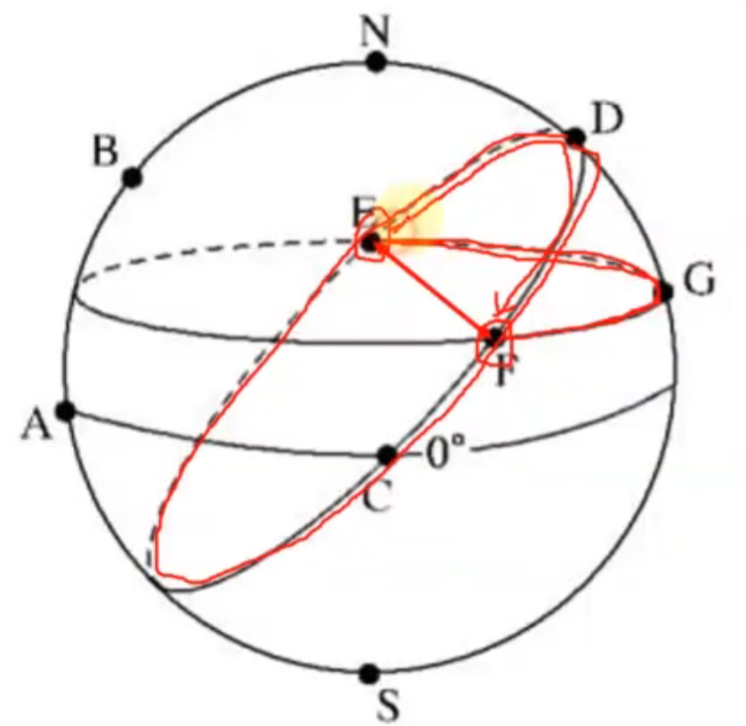
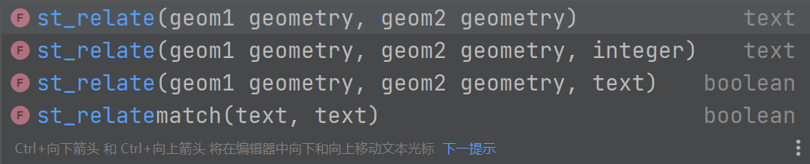

# 空间数据库原理与PostGIS应用

本文主要内容来自b站视频，[空间数据库原理与PostGIS应用_哔哩哔哩_bilibili](https://www.bilibili.com/video/BV1U7411c7wc?spm_id_from=333.337.search-card.all.click)

多参考官方文档[官方文档地址 | PostGIS](https://postgis.net/documentation/)


[toc]


## 1.绪论

对于多用户的支持，复杂的即时查询和对于大型数据集的高性能处理表现，空间数据库比文件系统优越。

### 基本概念

- 数据（data）
- 数据处理（data process）
- 数据库（database）
- 数据库管理系统（Database Management System）
- 数据库系统（Database System）
- 空间数据（Spatial Data） -- 简单粗略来说，带有地理空间坐标的数据
- 空间数据库

### GIS空间数据库发展历史

- 人工管理（20世纪50年代前）
- 图形与文件关系数据库
- 全关系数据库
- 对象关系数据库（90年代）
- 面向对象的数据库


### 空间数据库的组成和结构

硬件、软件、数据库、管理员、用户


内模式：数据在硬件中的存储方式之类，关注如何存储。

模式：可以理解为表？？？，（概念模式）在数据库软件中表现的形式，关系，内容。

外模式：视图，只是一个定义，视图中的数据来自（概念模式）逻辑关系型数据库。由每个表构建形成<strong style="color: rgb(220,70,56)">。</strong> 


数据库的物理存储：

1. 数据文件
2. 数据字典（元数据）
3. 索引
4. 统计数据
5. 日志

### 空间数据库的作用

1. 空间数据处理与更新
2. 海量数据存储与管理
3. 空间分析与决策
4. 空间信息交换与共享

### 空间数据库的特征

1. 综合抽象特征
2. 非结构化特性
3. 分类编码特征
4. 复杂性与多样性

### 与传统数据库的差异

1. 信息描述差异
2. 数据管理差异
3. 数据操作差异
4. 数据更新差异
5. 服务应用差异


## 2.空间数据组织与管理

### （1）空间数据特征

- 海量性
- 时空特征
- 不确定性
- 多尺度性
- 多维结构

### （2）空间数据来源


### （3）元数据

描述数据的数据，

经典的元数据，地图中的图例

一本书的内容是数据，那么其中的作者，出版社等信息就是元数据

### （4）空间数据的内容

矢量数据和对象模型？

栅格数据和场模型？


一个空间要素对应数据库的一条记录；

使用多个字段表达多重属性；


**矢量数据组织与编码方式**

- 基本概念

​		矢量数据，拓扑结构，即基本要素点线面和实体之间具有邻接、关联和包含的拓扑关系。 --点在多边形内 是拓扑关系

- 路径拓扑模型

1. 面条模型、
2. 多边形模型（公共边存储两次 ）
3. 点位字典模型：目前空间数据库用的较多的一种
4. 点扩展的路径拓扑模型：多边形 => 弧段ID => 点位ID => 点位坐标


- 网络拓扑模型

1. DIME文件（双重独立地图编码文件）
2. POLYVRT模型（以弧段为存储单元）
3. 扩展弧段模型（包含左右弧段）


## 3.数据库查询与操作

- 扩展相关

```sql
-- 查询已安装扩展
SELECT * FROM pg_extension; 
-- 查询可用扩展
SELECT * FROM pg_available_extensions;

-- 安装PostGIS扩展
create extension postgis;
-- 查询postgis版本
select postgis_full_version();
```

- 矢量导入可以用QGIS


### （1）Geometry基础

#### 1. 一些基本函数（持续补充。。。）

- ST_GeometryType(geom) -- 返回geom类型
- ST_NDims(geom) -- 返回geom维数
- ST_SRID(geom) -- 返回geom的SRID

PostgreSQL 简短的类型转换语法：

old::new 

#### <strong style="color: rgb(220,70,56)">2. wkt转为geojson:</strong>

```sql
  select 'POINT (0 0)'::geometry
  -- 使用类型转换创建geometry，除非指定srid，否则得到未知srid
  -- EWKT形式创建
  select 'srid = 4326; point(117 36)'::geometry
```


查看当前数据库中的有关geometry的表，<strong style="color: rgb(220,70,56)">geometry_columns视图</strong>

#### 3. 更新SRID的方法

1. updategeometrysrid( )

```sql
-- 直接赋予
select updategeometrysrid('geometries','geom', 4326)
```


#### 4. 元数据表/视图

##### 1. spatial_ref_sys

定义了数据库已知的所有空间参照系统

#####  2.geometry_columns

提供了数据库中所有空间数据表的描述信息

其中包括，数据库名、架构名、表名、geometry字段列名、geom维数、srid和Geom Type


#### 5. 3D几何对象

对于每个坐标，支持用于表示高度信息的'Z'维度以及用于添加额外附加信息的'M'维度（通常为时间或距离信息）

添加额外维度信息会为每个基本几何图形额外添加三种图形类型：

PointZ，PointM，PointZM


除了标准类型的高维形式，PostGIS还包括其他的三维数据类型：

- TIN（不规则三角网）允许将三角形网格建模为数据库中的行。
- POLYHEDRALSURFACE（多面体表面）可以在数据库中对体积对象进行建模。


### （2）Geography

为了计算出真实的距离，不能把地理坐标近似的看成笛卡尔平面坐标，而应该把它们看成球坐标。把两点之间的距离作为球面上真实路径来测量--大圆

<strong style="color: rgb(220,70,56)">大圆</strong>：过球心的平面和球面的交线。



不同的空间数据库有不同的“处理地理”的方法。

计算地理坐标系的距离，使用st_geographyfromtext(wkt)函数，代替geometry。

#### 1. 使用Geography

geometry => geography

先将geom转到EPSG:4326(lon,lat)，然后转为geog

- st_transfrom(geom, srid)，转换SRID
- geography(geom) 将基于EPSG:4326的geom 转为geog


从已有的geom转为geog并创建新表

```sql
create table nyc_subway_stations_geog as
    select
           geography(st_transform(geom,4326)) as geog,
           name,
           routes
from nyc_subway_stations;
```

geog支持的函数比geom的略少一点。

#### 2. 转为geom

geography::geometry  即可实现快速转换。

#### 3. 为什么不直接使用geography

- 直接经纬度计算是对计算机不友好的方式。相同的计算比笛卡尔计算量要大。
- 直接支持的geography函数不多。
- 地理范围是紧凑的（省市或更小）用geom。
- 地理范围是分散的（洲或者世界）用geog。

### （3）Geom的属性查询

简单的SQL语句：

```sql
select name from nyc_neighborhoods;
```

字符串长度查询：

```sql
select chsr_length(name) from nyc_neighborhoods
```

聚合函数（aggregate）对多行数据进行操作：

```sql
-- avg() 		平均数
-- stddev() 标准差
-- sum()		求和
-- count()  计数
```

聚合函数通常需要添加 <strong style="color: rgb(255,0,0)">group by</strong> 语句 ，以便于一个或多个列结果记录集进行分组。

```sql
select boroname,
       avg(char_length(name)),
       stddev(char_length(name))
from nyc_neighborhoods
group by boroname;
```

### （4）基础空间查询

查询包含空洞的多边形数量：

```sql
SELECT Count(*)
  FROM nyc_census_blocks
  WHERE ST_NumInteriorRings(ST_GeometryN(geom,1)) > 0;
```


### （5）空间关系查询

#### 1. 空间关系基础

```sql
-- OGC定义的一些空间拓扑关系

-- 相同类型的几何图形有相同的xy坐标，返回true
st_equals(geom A, geom B)

-- 两个图形有相同部分，返回true
st_intersects(geom A, geom B)

-- 相离，但not intersect效率更高,intersect可以使用空间索引
st_disjoint(geom A, geom B)

-- 交叉：两个几何相交生成的几何维度小于他们最大维度，返回true
st_crosses(geom A, geom B)

-- 重叠：相同维度的相交的结果是同维度的不同图形，返回true
st_overlaps(geom A, geom B)

-- 邻接：测试两个图形是否边界接触，内部不相交
st_touches(geom A, geom B)

-- 内部：geom A完全在geom B内部，返回true
st_within(geom A, geom B)

-- 包含：geom B完全在geom A内部，返回true
st_contains(geom A, geom B)
```

- 查询宽街地铁站所在社区：

```sql
-- 查询地铁站所在的社区
select nh.name
from nyc_neighborhoods nh
where st_intersects(
    (select geom
            from nyc_subway_stations sub
            where sub.name = 'Broad St'),
    nh.geom) = true;
    
-- Financial District    
```

- geom之间的距离是否在某个范围之内：

```sql
-- st_dwithin
-- 查找地铁站50米内的街道
select name, st_transform(geom, 4326)
from nyc_streets
where st_dwithin(
    geom,
    (select geom from nyc_subway_stations where name = 'Broad St'),
    50);
```

- Atlantic Commons 与哪些街道相连

```sql	
-- st_crosses 好像没用
select name, st_transform(geom,4326) from nyc_streets
where st_touches(
    geom,
    (select geom from nyc_streets where name = 'Atlantic Commons')
    )
```

- 大约多少人住在Atlantic Commons 50米以内

```sql
select sum(popn_total)
from nyc_census_blocks cb
where st_dwithin(
    geom,
    (select geom from nyc_streets where name = 'Atlantic Commons'),
    50
    );
```


#### 2. 九交模型

先说在PostGIS里，可以用获取九交模型的函数

```sql
-- 两个参数返回九交模型的值
select st_relate(
  'linestring(0 0, 2 0)',
	'linestring(0 1, 1 0)'
)

-- 三个参数返回是否符合第三个九交模型的值。
-- 0,1,2,T,F,*   T是0，1，2的通配，*是代表可以为任何的选项。

select st_relate(
  'linestring(0 0, 2 0)',
	'linestring(0 1, 1 0)',
  '1010F0212'
)
```



作用：

<strong style="color: rgb(255,0,0)">查找具有特定关系的几何图形</strong>

<strong style="color: rgb(255,0,0)">数据质量测试</strong>

---

[空间拓扑关系描述:九交模型(DE-9IM)](https://www.jianshu.com/p/393b97b0e96d)

- 已知两个几何对象geom A，geom B，如何描述A与B的拓扑关系？维数扩展的九交叉模型给出的解决方案是通过描述A与B的<strong style="color: rgb(255,0,0)">内部(Interior , I)，边界(Boundary , B)，外部(Exterior , E)</strong>之间的关系来表达A与B的拓扑关系，内部(I)、边界(B)、外部(E)三者的关系构成了一个3×3的交集矩阵：


dim是dimension的缩写，指的是维度。

1. 多边形的维度是2，含组合多边形，带洞多边形等。
2. 折线的维度为1，含多线。
3. 点的维度为0，含多点。
4. 空集(无交集)维度为F。

---

- 对于多边形，内部是多边形的外环和内环围起来的面部分，边界由内环和外环构成，外部是除内部和边界以外的空间其他所有部分。
- 对于线要素，边界是<strong style="color: rgb(255,0,0)">线首尾节点(中间节点不算)，内部是线上除了首尾节点之外的部分</strong>。外部是空间除了内部与边界的部分。
- 点要素的内部是点本身，其边界是空集，外部是除了点本身外的空间其他部分。当然，对于点与其他要素的拓扑关系，我们通常习惯用“点在对象上”、“点不在对象上”进行描述，而且，在空间关系的计算上，也会按照这样的思路设计算法。我的意思是，对于点的拓扑关系处理一般先判断“点是否在对象上”然后填充9交叉模型矩阵的，而不是像多边形之间的关系判断。

---

- 简单的九交模型：

1. 当维度0,1,2时表示非空，用T进行表示；
2. 空集仍然用F表示；
3. 引入*表示是什么都可以，geos中为“DONTCARE”


- 8种常见拓扑关系的关系


- <strong style="color: rgb(255,0,0)">9-交模型的局限性</strong>

从某种意义上讲，9-交模型所描述的拓扑关系只是拓扑关系的类别，对于每一类别可以有多种可能的情形，例如两条相交的线，一个交点的情形（交叉）和多个交点（部分重合）的9-交模型表示是一致的，但是其拓扑关系并不同。用<strong style="color: rgb(255,0,0)">相交图形的维数0，1，2代替相交时的T</strong>

#### 3. 空间连接

- 空间连接（spatial joins）是空间数据库的主要组成部分，它们允许你使用<strong style="color: rgb(255,0,0)">空间关系作为连接键(join key)</strong>来连接来自不同数据表的信息。在前面课中，我们通过两个步骤探索了空间关系：首先，我们提取了‘Broad St (宽街) '的地铁站点；然后，我们用这个地铁站点来做进一步的查询，如"BroadSt站位于哪个社区? "

- 使用空间连接，我们可以只通过一个步骤来回答这个问题，检索有关地铁站及其所在社区的信息：

  ```sql
  -- nb表关联到nss表，通过空间连接 
  select nss.name subway_name,
         nb.name,
         nb.boroname
  from nyc_neighborhoods nb
  join nyc_subway_stations nss
  on st_contains(nb.geom, nss.geom)
  where nss.name = 'Broad St';
  
  -- 普通的连接 
  from nyc_neighborhoods nb
  join nyc_subway_stations nss
  on nss.id = nb.id
  ```

  

  - JOIN 和 GROUP BY 的组合支持通常在GIS系统种的某些分析。
  - JOIN子句创建了一个虚拟表，其中包含来自neighborhoods表和subway_stations表的列。
  - WHERE子句将我们的虚拟表筛选为仅保留有关曼哈顿行政区的记录。
  - 结果记录按neighborhood name分组，并通过聚合函数Sum()计算人口数
  - 注意: JOIN子句组合了两个FROM子句中的数据表，默认情况下，数据库使用的是INNER JOIN连接类型，但还有其他四种连接类型。
  
  
  
  去重标记 distinct
  
  ```sql
  select distinct routes from nyc_subway_stations;
  ```
  
  查询地铁A线路地铁站，附近200米的人口比例：
  
  ```sql
  select  100*sum(ncb.popn_white)/sum(ncb.popn_total) white_pct,
          100*sum(ncb.popn_black)/sum(ncb.popn_total) black_pct
  from nyc_subway_stations nss
  join nyc_census_blocks ncb
  on st_dwithin(ncb.geom, nss.geom, 200)
  where strpos(routes,'A') > 0;
  ```

<strong style="color: rgb(255,0,0);font-size:130%">空间连接进阶:</strong>

先根据tractID分组合并geom：

```sql
-- 遇见的一个报错
-- [22023] 错误:
-- Geometry type (Polygon) does not match column type (MultiPolygon)
-- 解决方案，用st_multi() 将polygon 转为multipolygon，multi类型返回自身

create table nyc_census_tract_geom as
select
    st_multi(st_union(geom))::geometry(multipolygon, 26918) as geom,
    substr(blkid,1,11) as tractid
from nyc_census_blocks
group by tractid;
```


列出纽约受过教育的总人口数排名前十的社区：

```sql
select sum(t.edu_total) popul,
       h.name,
       h.boroname
from nyc_neighborhoods h
         join nyc_census_tracts t
              on st_intersects(h.geom, t.geom)
group by h.name, h.boroname
order by popul desc
limit 10;
```


使用多边形的质心让多边形不再重复统计：

```sql
select 100.0 * sum(t.edu_graduate_dipl) / sum(t.edu_total) graduate_pct,
       h.name,
       h.boroname
from nyc_neighborhoods h
         join nyc_census_tracts t
              on st_contains(h.geom, st_centroid(t.geom))
where t.edu_total > 0
group by h.name, h.boroname
order by graduate_pct desc;
```

利用distinct 去重

```sql
with distinct_blocks as (
    select distinct on (blkid) popn_total
    from nyc_census_blocks cb
             join nyc_subway_stations nss
                  on st_dwithin(cb.geom, nss.geom, 500)
)
select sum(popn_total)
from distinct_blocks;
```


#### 4.几何对象创建函数

（1）“几何对象创建函数”以几何图形作为输入并输出新的图形的函数。

```sql
-- 返回几何图形的质心，不一定在几何图形内
st_centroid(geom)

-- 返回保证在输入多边形内的点，比centroid代价大
st_pointonsurface(geom)

-- 返回一个多边形，多边形边界与geom之间距离是distance
st_buffer(geom, distance)

-- 返回两个geom的共有区域（或线，或点）
st_intersection(geom A,geom B)

-- 返回合并后的geom
st_union(geom A,geom B)
```

（2）根据条件分组合并多边形：

```sql
-- 创建一个表，并由新的查询语句写入内容
create table nyc_census_counties as
select
    st_union(geom)::Geometry(MultiPolygon, 26918) as geom,
    substr(blkid,1,5) as countyid
from nyc_census_blocks
group by countyid;
```

（3）复杂的几何创建

根据离散的地铁站点构建一条线路 ⭐

```sql
-- 不了解的知识点
-- recursive 递归
-- union all
-- @>
-- array

with recursive next_stop(geom, idlist) as (
    (select geom,
            array [objectid] as idlist
     from nyc_subway_stations
     where objectid = 304)
    union all
    (select s.geom,
            array_append(n.idlist, s.objectid) as idlist
     from nyc_subway_stations s,
          next_stop n
     where strpos(s.routes, 'Q') != 0
       and not n.idlist @> array [s.objectid]
     order by st_distance(n.geom, s.geom)
     limit 1)
)
select st_transform( st_makeline(geom),4326)
from next_stop;
```


#### 5. 几何对象的校验与修复

运行后出现TopologyException错误

使用st_isvalid(geom) 函数进行校验：

```sql
select st_isvalid(
    'polygon((0 0,0 1,1 1,2 1,2 2,1 2,1 1,1 0,0 0))'::geometry
    );
    
-- 查找无效原因
select st_isvalidreason(    
    'polygon((0 0,0 1,1 1,2 1,2 2,1 2,1 1,1 0,0 0))'::geometry
		);
-- 返回Self-intersection[1 1]

-- 校验表中的geom，
select name, boroname, st_isvalidreason(geom)
from nyc_neighborhoods
where not st_isvalid(geom);
```

修复有问题的geom：

```
-- 没有100%可以修复无效图形的办法
-- 用桌面端进行修复
-- st_makevalid() 不会删除或移动点位置，只是重新排列
-- st_buffer()
```

#### 6. 几何对象的相等与参考

[PostGIS教程十六：几何图形的相等 - 知乎 (zhihu.com)](https://zhuanlan.zhihu.com/p/63653261)

（1）<strong style="color: rgb(255,0,0)">精确相等（st_orderingEquals 或 =）:</strong>

​		精确相等是通过按顺序逐个比较两个几何图形的顶点来确定的，以确保它们在位置上是相同的。下面的例子说明了这种方法的有效性是如何受到限制的。

```sql
-- 进行两两判断，case when 相当于if语句
SELECT a.name, b.name, 
CASE WHEN ST_OrderingEquals(a.poly, b.poly)
    THEN 'Exactly Equal' ELSE 'Not Exactly Equal' 
		end
FROM polygons as a, polygons as b;
```


(2) <strong style="color: rgb(255,0,0)">空间相等（st_euqls）</strong>

​	精确的相等（ST_OrderingEquals）并没有考虑到几何图形的空间性质。有一个名为**ST_Equals**的函数，可用于测试几何图形的 <strong style="color: rgb(0,0,255)">空间相等性或等价性</strong>。

```sql
SELECT a.name, b.name, 
CASE WHEN ST_Equals(a.poly, b.poly)
    THEN 'Spatially Equal' ELSE 'Not Equal' 
		end
FROM polygons as a, polygons as b;
```

(3) <strong style="color: rgb(255,0,0)">包围框相等（~=）</strong>

​	精确相等来比较几何图形中的每个顶点以确定相等。这可能会比较慢（计算量比较大），不适合数量很多的几何图形。为了更快地进行比较，提供了包围框（bounding box）相等运算符 ' **~=** ' 。这仅在包围框（矩形）上操作，确保几何图形占用相同的二维范围，但不一定占用相同的空间。

```sql
SELECT a.name, b.name, 
CASE WHEN a.poly ~= b.poly
    THEN 'Equal Bounds' ELSE 'Non-equal Bounds' 
    end
FROM polygons as a, polygons as b;
```

（4）<strong style="color: rgb(255,0,0)">线性参考</strong>	

作用1：可以将点正确的捕捉的最近的线上

​	**线性参考**是一种表示要素的方法，这些要素可以通过引用一个基本的线性要素来描述。线性参考模型的优点是， <strong style="color: rgb(0,0,255)">从属空间观测信息</strong>不需要与 <strong style="color: rgb(0,0,255)">基准空间观测信息</strong>分开记录，对基础观测信息进行更新时，从属观测信息 <strong style="color: rgb(0,0,255)">将自动更新从而追踪</strong>新几何图形。

​	ESRI的线性参照约定是有一个线性空间要素的**基表**和一个<strong style="color: rgb(0,0,255)">非空间的事件表</strong>，其中非空间的**事件表**包括对空间要素的外键引用和沿参照要素的测量值。我们将使用术语"**事件表(event table)**"来表示我们构建的非空间表。

（5）<strong style="color: rgb(255,0,0)">创建线性参考：</strong>

如果有一个要引用到线性网络的现有点表，要计算各点的线性参考比例，请使用**ST_LineLocatePoint**函数，该函数接受线串和点，并返回该点沿线串的线性参考比例。

```sql
- Simple example of locating a point half-way along a line
SELECT ST_LineLocatePoint('LINESTRING(0 0, 2 2)', 'POINT(1 1)');
-- return 0.5
 
-- What if the point is not on the line? It projects to closest point
-- 即做(0, 2)点到线串(0 0, 2 2)的垂线，使用对应的垂足点来求线性参考比例
SELECT ST_LineLocatePoint('LINESTRING(0 0, 2 2)', 'POINT(0 2)');
-- return 0.5
```

我们可以使用ST_LineLocatePoint函数根据nyc_subway_stations创建相对于街道的"**事件表**"。

```sql
-- 下面所有的SQL都是用来创建新的事件表的
CREATE TABLE nyc_subway_station_events AS
-- 我们首先需要找到一组可能最接近的候选者
-- streets, 按id和distance排列...
WITH ordered_nearest AS (
SELECT
  ST_GeometryN(streets.geom,1) AS streets_geom,
  streets.gid AS streets_gid,
  subways.geom AS subways_geom,
  subways.gid AS subways_gid,
  ST_Distance(streets.geom, subways.geom) AS distance
FROM nyc_streets streets
  JOIN nyc_subway_stations subways
  ON ST_DWithin(streets.geom, subways.geom, 200)
ORDER BY subways_gid, distance ASC
)
-- 我们使用'distinct on'使每个地铁站信息只出现一次。
-- 然后，我们可以将这条街道信息置入ST_LinLocatePoint函数，使其沿着它的候选地铁站来计算
SELECT
  DISTINCT ON (subways_gid)
  subways_gid,
  streets_gid,
  ST_LineLocatePoint(streets_geom, subways_geom) AS measure,
  distance
FROM ordered_nearest;
 
-- 主码对于可视化软件很有用
ALTER TABLE nyc_subway_station_events ADD PRIMARY KEY (subways_gid);
```


一旦我们有了一个**事件表**，将其转换回一个空间视图是很有趣的，这样我们就可以将**事件**相对于派生出它们的原始点进行可视化。

要从线性参考比例值得到位于线段上的对应点，我们可以使用**ST_LineInterpolatePoint**函数，下面是关于我们前面的简单例子的逆过程：

```sql
-- Simple example of locating a point half-way along a line
SELECT ST_AsText(ST_LineInterpolatePoint('LINESTRING(0 0, 2 2)', 0.5));
 
-- Answer POINT(1 1)
```

我们可以将nyc_subway_station_events表连接回nyc_streets表，并使用measure属性生成**空间事件点**（这个示例中是地铁站点），而无需引用原始nyc_subway_stations表。

```sql
-- New view that turns events back into spatial objects
CREATE OR REPLACE VIEW nyc_subway_stations_lrs AS
SELECT
  events.subways_gid,
  ST_LineInterpolatePoint(ST_GeometryN(streets.geom, 1), events.measure) AS geom,
  events.streets_gid
FROM nyc_subway_station_events events
JOIN nyc_streets streets
ON (streets.gid = events.streets_gid);
```


**注意**：**线性参考函数**的一个令人惊讶的用法与线性参考模型无关。如上所示，可以使用这些函数将点**捕捉**到线性要素（即可以使用**线性参考**来实现**捕捉**功能）。对于像GPS轨迹或其他预期参考线性网络的输入这样的用例，**捕捉**是一个方便的功能。

<strong style="color: rgb(0,0,255)">相关函数列表：</strong>

- **[ST_LineInterpolatePoint(geometry A, double measure)](http://postgis.net/docs/ST_LineInterpolatePoint.html)**: Returns a point interpolated along a line.
- **[ST_LineLocatePoint(geometry A, geometry B)](http://postgis.net/docs/ST_LineLocatePoint.html)**: Returns a float between 0 and 1 representing the location of the closest point on LineString to the given Point.
- **[ST_Line_Substring(geometry A, double from, double to)](http://postgis.net/docs/ST_Line_Substring.html)**: Return a linestring being a substring of the input one starting and ending at the given fractions of total 2d length.
- **[ST_Locate_Along_Measure(geometry A, double measure)](http://postgis.net/docs/ST_Locate_Along_Measure.html)**: Return a derived geometry collection value with elements that match the specified measure.
- **[ST_Locate_Between_Measures(geometry A, double from, double to)](http://postgis.net/docs/ST_Locate_Between_Measures.html)**: Return a derived geometry collection value with elements that match the specified range of measures inclusively.
- **[ST_AddMeasure(geometry A, double from, double to)](http://postgis.net/docs/ST_AddMeasure.html)**: Return a derived geometry with measure elements linearly interpolated between the start and end points. If the geometry has no measure dimension, one is added.

## 4.空间数据索引


## 5.空间数据库设计与建设


## 6.实战

### 案例一	剖面分析


```sql
with profile as (
    select st_3dintersection(geom,
                             'srid=4326; polygon((' ||
                             'lon lat -20,' ||
                             'lon lat -20,' ||
                             'lon lat 40,' ||
                             'lon lat 40,' ||
                             'lon lat -20))')
               as geom
    from ws_line_new117
    where st_3dintersects(
                  geom,
                  'srid=4326; polygon((' ||
                  'lon lat -20,' ||
                  'lon lat -20,' ||
                  'lon lat 40,' ||
                  'lon lat 40,' ||
                  'lon lat -20))')
)
select st_z(profile.geom),
       st_distance('srid=4326;point (116.2387972701893 36.87445864295117)'::geography,
                   profile.geom::geography) distance,
       featuregui
from profile,ws_line_new117
order by distance;
```


## 7.PostgreSQL技术陈杂

### 一、With 有关

[PostgreSQL中RECURSIVE递归查询使用总结 - ZhanLi - 博客园 (cnblogs.com)](https://www.cnblogs.com/ricklz/p/12590618.html?msclkid=b2689d3dcfa811ec80eeb892b0d4afb0)

先看一下这个明天整理一下。22-5-9


<strong style="color: rgb(255,0,0);font-size:130%">WITH语句</strong>通常被称为通用表表达式（Common Table Expressions）或者CTEs。它们可以被看成是定义只在一个查询中存在的临时表。

WITH语句作为一个辅助语句依附于主语句，WITH语句和主语句都可以是SELECT，INSERT，UPDATE，DELETE中的任何一种语句。

举个栗子

```sql
WITH result AS (
    SELECT d.user_id
    FROM documents d
    GROUP BY d.user_id
),info as(
    SELECT t.*,json_build_object('id', ur.id, 'name', ur.name) AS user_info
    FROM result t
    LEFT JOIN users ur on ur.id = t.user_id
    WHERE ur.id IS NOT NULL
)select * from info
```

